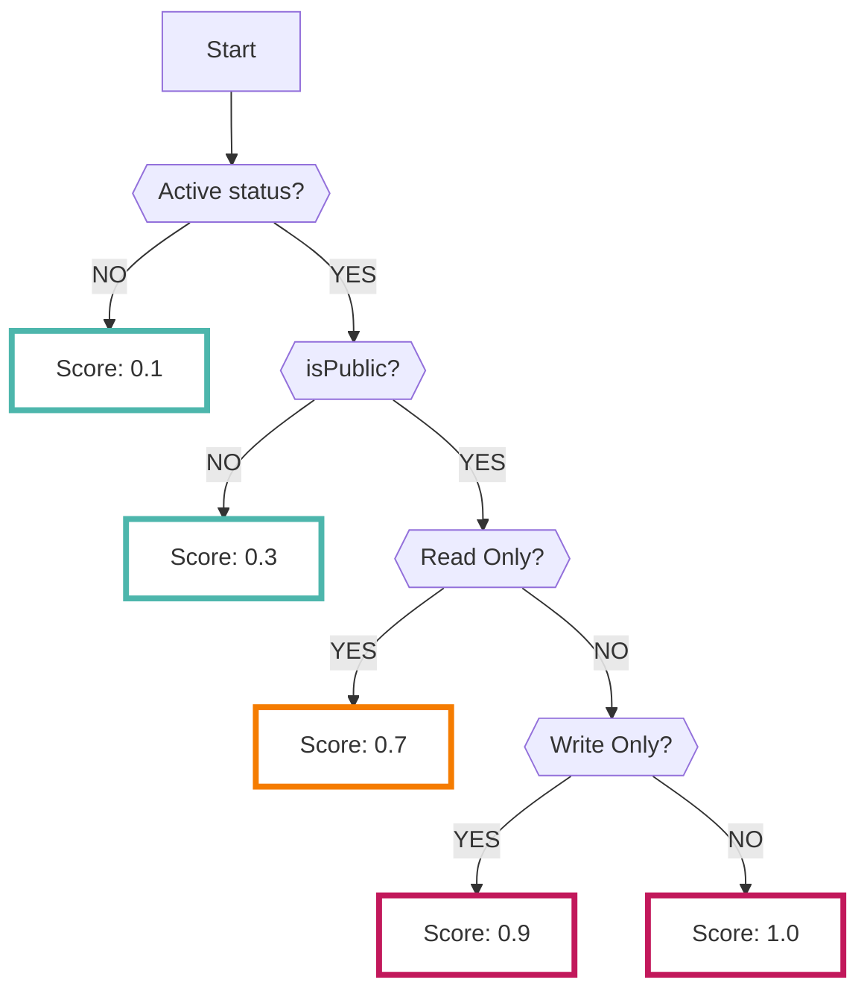

# AccessAnalyzer

Enabling the AccessAnalyzer data source collects the results analyzed by [AWS AccessAnalyzer service :octicons-link-external-24:](https://docs.aws.amazon.com/IAM/latest/UserGuide/what-is-access-analyzer.html){ target="_blank" }.

???+ tip "What is AccessAnalyzer?"
    - AWS AccessAnalyzer is a service that helps discover resources shared outside of your AWS account.
    - Refer to the [official documentation :octicons-link-external-24:](https://docs.aws.amazon.com/IAM/latest/UserGuide/access-analyzer-resources.html){ target="_blank" } for services supported by AccessAnalyzer.
    - AccessAnalyzer analysis results may be delayed by several minutes to 24 hours. Typically, scans are performed upon detecting access policy change events, but there may be a delay of a few hours to a maximum of 24 hours under certain conditions. For more information, refer to the [official documentation :octicons-link-external-24:](https://docs.aws.amazon.com/ja_jp/IAM/latest/UserGuide/what-is-access-analyzer.html){ target="_blank" }.

---

## Format

When importing data into RISKEN, the following metadata is added:

| Field         | Description                                                     |
| ------------- | --------------------------------------------------------------- |
| `DataSource`  | aws:access-analyzer (fixed value)                                |
| `ResourceName`| The ARN of the resource detected by AccessAnalyzer                |
| `Description` | Description                                                      |
| `Score`       | Refer to [Scoring](/aws/accessanalyzer/#_2)                      |
| `Tag`         | `aws` `access-analyzer` `{type}` `{account ID}`                   |

---

## Scoring

AWS AccessAnalyzer does not provide scoring information. 

Therefore, when importing to RISKEN, we judge the severity and score based on the following logic:

