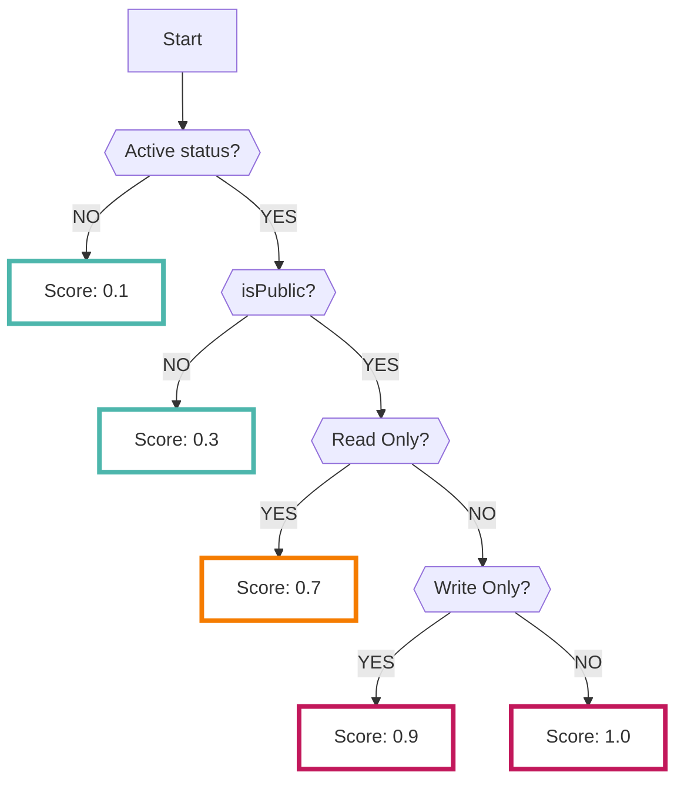

# AccessAnalyzer

AccessAnalyzerデータソースを有効にすると、AWSの[AccessAnalyzerサービス](https://docs.aws.amazon.com/IAM/latest/UserGuide/what-is-access-analyzer.html)で分析された結果を収集保存されます

- AWS AccessAnalyzerは、自身のAWSアカウント外へ共有しているリソースを発見するのに便利なサービスです
- AccessAnalyzerでサポートされているサービス等については[公式ドキュメント](https://docs.aws.amazon.com/IAM/latest/UserGuide/access-analyzer-resources.html)を参照してください

---

## フォーマット

RISKENへデータを取り込む際に、以下のメタデータを付加します

| 項目            | 説明                                      |
| -------------- | ---------------------------------------- |
| `DataSource`   | aws:access-analyzer (固定)                |
| `ResourceName` | AccessAnalyzerで検知したリソースのARN        |
| `Description`  | リソース情報とパブリック可否                  |
| `Score`        | [スコアリング](/aws/accessanalyzer/#_2)参照 |
| `Tag`          | `aws` `access-analyzer` `{タイプ}`         |

---

## スコアリング

AWSのAccessAnalyzerはスコア情報を持っていません。
なので、RISKENに取り込む際に、以下のロジックによって危険度を判定しスコアリングしています。

