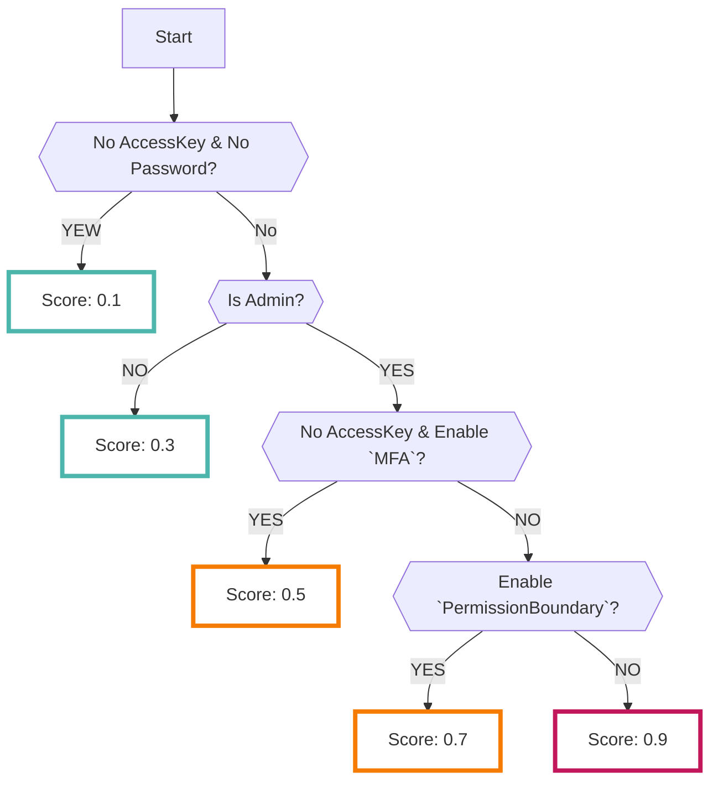
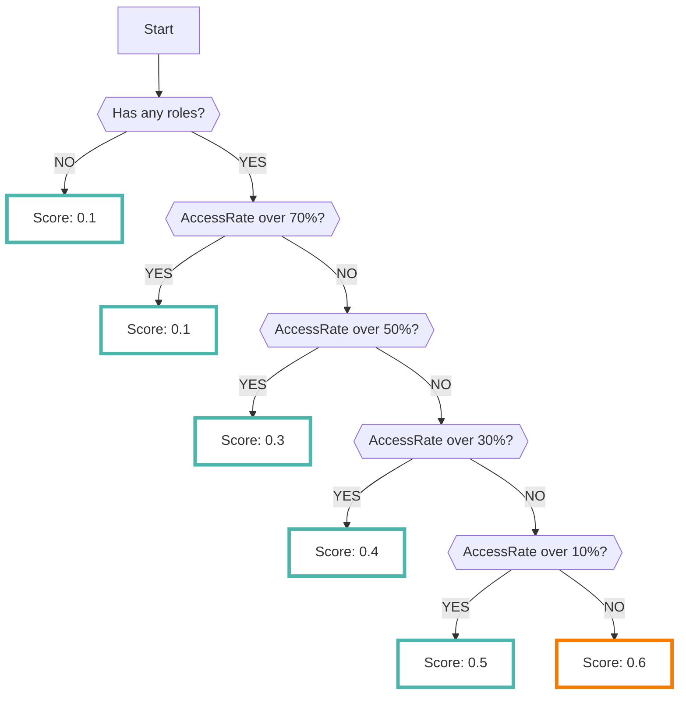

# Admin Checker

Enabling the AdminChecker data source extracts strong privileges or over-granted IAM resources in the AWS IAM service.

???+ tip "What is AdminChecker?"
    - AdminChecker is a check tool developed by the RISKEN team (not an AWS service)
    - The following scanners are implemented:
        - `Privilege user check`
        - `Minimum permission check`

## Privilege user check

- `Privilege user check` checks if a user or group has administrative rights or privileges.
- The privilege check becomes `true` in the following cases:
    - AdministratorAccess (managed policy) is granted
    - IAMFullAccess (managed policy) is granted
    - AdministratorAccess equivalent is granted in the inline policy
    - IAMFullAccess equivalent is granted in the inline policy
- Scoring is based on the assumption that highly misused credentials are evaluated as high scores for privileged users (the score may fluctuate depending on factors such as the presence or absence of MFA).

??? Warning "In privilege user determination, some setting items are ignored"
    - Deny rules
        - Although deny rules are given the highest priority in [IAM policy evaluation logic :octicons-link-external-24:](https://docs.aws.amazon.com/IAM/latest/UserGuide/reference_policies_evaluation-logic.html){ target="_blank" }, AdminChecker ignores them.
        - Therefore, there is a possibility that even if you do not actually have privileges due to deny rules, you may be determined as a privileged user.
    - Conditions rules
        - The conditions may cause low-risk users to be included in a high-scoring (privileged user) state.
    - PermissionBoundory rules
        - Although a reduction in risk is achieved through PermissionBoundary, AdminChecker does not look at the details of the settings (almost ignored).

## Minimum permission check

- `Minimum permission check` scans IAM users and IAM roles that have been granted more permissions than necessary based on the data of [AceessAdvisor :octicons-link-external-24:](https://docs.aws.amazon.com/IAM/latest/UserGuide/access_policies_access-advisor-view-data.html){ target="_blank" }.
- This scanner is based on the philosophy of [best practices for minimum permissions :octicons-link-external-24:](https://docs.aws.amazon.com/IAM/latest/UserGuide/best-practices.html){ target="_blank" }.
    - Calculates the ratio of the number of accessed services to the number of permitted AWS services.
    - The higher the above ratio, the higher the score.
    - Use cases include IAM user and IAM role inventories.

---

## Format

When importing data into RISKEN, the following metadata is added:

| Field         | Description                                                                                              |
| ------------- | -------------------------------------------------------------------------------------------------------- |
| `DataSource`  | aws:admin-checker (fixed)                                                                                |
| `ResourceName`| IAM user ARN                                                                                            |
| `Description` | Description                                                                                              |
| `Score`       | See [Scoring](/aws/adminchecker/#_4)                                                                      |
| `Tag`         | `aws` `admin-checker` `admin` (for privilege user check) `access-report` (for least privilege check) `{accountID}` |

---

## Scoring

When importing data into RISKEN, the following logic is used to determine the severity and score:

### Privilege User Check

### Least Privilege Check

