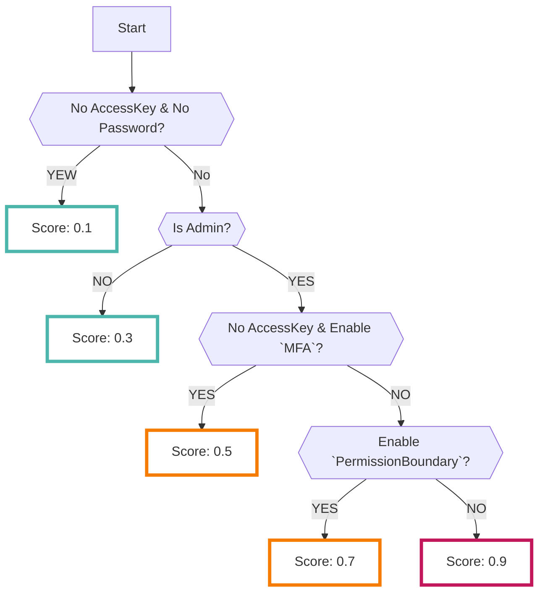
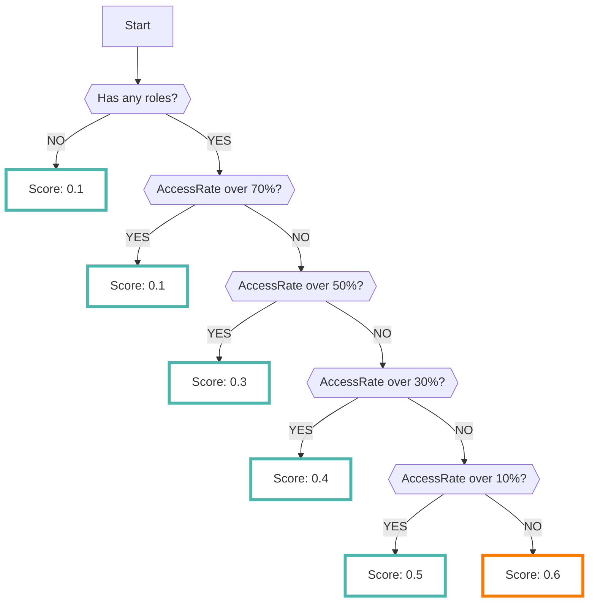

# Admin Checker

AdminCheckerデータソースを有効にすると、AWSのIAMサービスで強い権限、または過剰に付与されたIAMリソースを抽出します

???+ tip "AdminCheckerとは？"
    - AdminCheckerはRISKENチームが開発したチェックツールです（AWSのサービスではありません）
    - 以下のスキャナが実装されています
        - `特権ユーザチェック`
        - `最小権限チェック`

## 特権ユーザチェック

- `特権ユーザチェック`の判定はユーザまたはグループに対して管理者権限・特権を持っているかをチェックします
- 以下の場合に特権チェックが `true` となります
    - AdministratorAccess（マネージドポリシー）が付与されている
    - IAMFullAccess（マネージドポリシー）が付与されている
    - インラインポリシーにてAdministratorAccess相当が付与されている
    - インラインポリシーにてIAMFullAccess相当が付与されている
- スコアリングの考え方として特権ユーザのうちクレデンシャルが漏洩した際、悪用される可能性が高いものを高スコアとして評価します(例えばMFA設定の有無等によってスコアが変動します)

??? Warning "特権ユーザ判定では、いくつかの設定項目は無視されます"
    - Denyルール
        - Denyルールは[IAMのポリシー評価ロジック :octicons-link-external-24:](https://docs.aws.amazon.com/IAM/latest/UserGuide/reference_policies_evaluation-logic.html){ target="_blank" } 上、最も優先されますがAdminCheckerでは無視しています
        - なのでDenyルールによって実際は特権を持っていなかったとしても特権ユーザと判定される可能性があります
    - Conditionsルール
        - Conditionsにより漏洩リスク等の低いユーザでもスコアが高い状態（特権ユーザ）で取り込まれる可能性があります
    - PermissionBoundoryルール
        - PermissionBoundoryによってリスク低減がされている場合にはスコアが下がりますが、設定内容の詳細までは見ていません（ほぼ無視）

## 最小権限チェック

- `最小権限チェック`は、[AceessAdvisor :octicons-link-external-24:](https://docs.aws.amazon.com/IAM/latest/UserGuide/access_policies_access-advisor-view-data.html){ target="_blank" } のデータをもとに必要以上に権限が付与されているIAMユーザ、IAMロールをスキャンします
- このスキャナは[最小権限のプラクティス :octicons-link-external-24:](https://docs.aws.amazon.com/IAM/latest/UserGuide/best-practices.html){ target="_blank" } の思想を参考にしています
    - 許可されているAWSサービス数に対して実際にアクセス履歴があったサービスの割合を計算します
    - 上記の割合が大きいほど高スコアがつく仕組みになっています
    - IAMユーザやIAMロールの棚卸しなどのユースケースにご活用ください

---

## フォーマット

RISKENへデータを取り込む際に、以下のメタデータを付加します

| 項目           | 説明                                                                                                     |
| -------------- | -------------------------------------------------------------------------------------------------------- |
| `DataSource`   | aws:admin-checker (固定)                                                                                 |
| `ResourceName` | IAMユーザーのARN                                                                                         |
| `Description`  | 説明                                                                                                     |
| `Score`        | [スコアリング](/aws/adminchecker/#_4)参照                                                                |
| `Tag`          | `aws` `admin-checker` `admin` (特権ユーザチェック) `access-report` （最小権限チェック） `{アカウントID}` |

---

## スコアリング

RISKENに取り込む際に、以下のロジックによって危険度を判定しスコアリングしています

### 特権ユーザチェック

### 最小権限チェック

