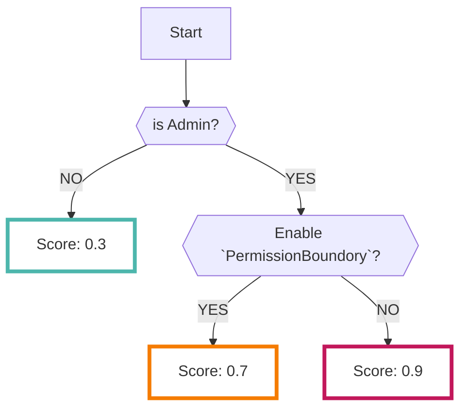

# Admin Checker

AdminCheckerデータソースを有効にすると、AWSの特権IAMユーザを抽出します

- AdminCheckerはRISKENチームが開発したチェックツールです（AWSのサービスではありません）
- `特権ユーザ`の判定はユーザまたはグループに対して以下を有する場合に `true` となります
    - AdministratorAccess（マネージドポリシー）が付与されている
    - IAMFullAccess（マネージドポリシー）が付与されている
    - インラインポリシーにてAdministratorAccess相当が付与されている
    - インラインポリシーにてIAMFullAccess相当が付与されている

???+ Warning "以下は考慮していません"
    - Denyルール
        - DenyルールはIAMの評価上最も優先されれますがAdminCheckerでは無視しています
        - なのでDenyルールによって実際は特権を持っていなかったとしても特権ユーザと判定される可能性があります
    - Conditionsルール
        - Conditionsにより漏洩リスク等の低いユーザでもスコアが高い状態（特権ユーザ）で取り込まれる可能性があります
    - PermissionBoundoryルール
        - PermissionBoundoryによってリスク低減がされている場合にはスコアが下がりますが、設定内容の詳細までは見ていません（ほぼ無視）

---

## フォーマット

RISKENへデータを取り込む際に、以下のメタデータを付加します

| 項目            | 説明                                      |
| -------------- | ---------------------------------------- |
| `DataSource`   | aws:admin-checker (固定)                  |
| `ResourceName` | IAMユーザーのARN                           |
| `Description`  | 特権ユーザかどうか                          |
| `Score`        | [スコアリング](/aws/adminchecker/#_2)参照   |
| `Tag`          | `aws` `admin-checker`                     |

---

## スコアリング

RISKENに取り込む際に、以下のロジックによって危険度を判定しスコアリングしています。

