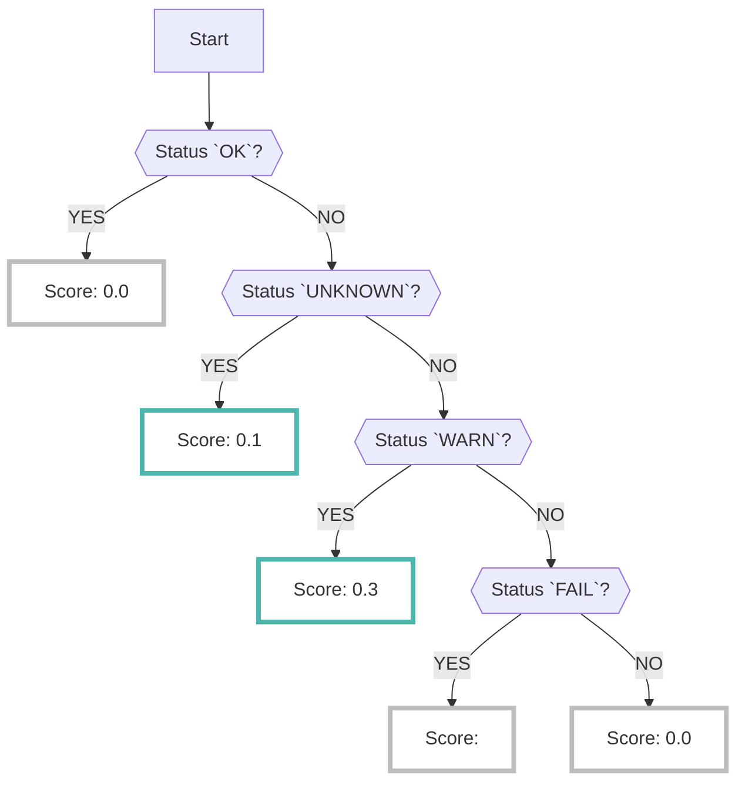

# CloudSploit

When the CloudSploit data source is enabled, the results analyzed by [CloudSploit :octicons-link-external-24:](https://github.com/aquasecurity/cloudsploit){ target="_blank" }, an open-source tool, are collected.

???+ help "What is CloudSploit?"
    - CloudSploit is an open-source [CSPM :octicons-link-external-24:](https://www.checkpoint.com/cyber-hub/cloud-security/what-is-cspm-cloud-security-posture-management/){ target="_blank" } tool provided by [AquaSecurity :octicons-link-external-24:](https://www.aquasec.com/){ target="_blank" }.
    - Please refer to the [GitHub :octicons-link-external-24:](https://github.com/aquasecurity/cloudsploit/tree/master/plugins/aws){ target="_blank" } page to see what items are detected by CloudSploit.

## Format

When importing data into RISKEN, the following metadata is added:

| Field          | Description                                              |
| -------------- | -----------------------------------------                |
| `DataSource`   | aws:cloudsploit (fixed)                                   |
| `ResourceName` | ARN of the detected resource                              |
| `Description`  | Description                                               |
| `Score`        | See [Scoring :octicons-link-external-24:](/aws/cloudsploit/#_2) |
| `Tag`          | `aws` `cloudsploit` `{AWS service}` `{compliance mark}` `{account ID}` `{plugin name}` `{Well-Architected tag}` |

＊ Please refer to the [/risken/well_architected](/risken/well_architected/) page for details on how to use the `Well-Architected` tag.

## Scoring

- The CloudSploit analysis results do not include score information.
- Only status information :octicons-link-external-24: (such as `PASS` (no risk) or `FAIL` (problem)) can be checked for each check item (plugin). 

    ??? Info "CloudSploit statuses"
        - 0: PASS: No risk
        - 1: WARN: There may be a configuration mistake. Or, there is a problem, but it does not require immediate action.
        - 2: FAIL: Risk present
        - 3: UNKNOWN: API execution failed due to insufficient IAM permissions, etc.

- However, it is difficult to determine how much risk each check item has, and if you try to check all of them, you will need to check a large number of alerts.
- Therefore, when importing into RISKEN, we perform scoring according to the following logic to examine the problems that should be prioritized (please see [Scoring per plugin :octicons-link-external-24:](/aws/cloudsploit/#_3) for details).
    - ＊Of course, it is also possible to check all `FAIL`.

## Scoring for each plugin

If a `FAIL` judgment is made on any of the [CloudSploit check items (plugins)](https://github.com/aquasecurity/cloudsploit/tree/master/plugins/aws){target="_blank"}, the score varies depending on the plugin.

In addition, compliance tags for standards such as CIS and PCIDSS are assigned depending on the plugin.

*All plugins not listed below will be given a score of `0.3`.

|Category|Plugin|Score|Compliance Tag|Memo|
|---|---|---|---|---|
|ACM|acmCertificateExpiry|0.6|pci||
|ACM|acmValidation|0.6||Updated 2021/06/17|
|AutoScaling|webTierAsgApprovedAmi|0.6||Updated 2023/04/11|
|CloudFront|insecureProtocols|0.6|hipaa, pci|Updated 2021/06/17|
|CloudTrail|cloudtrailBucketPrivate|0.8|cis1, cis|Updated 2021/06/17|
|CloudTrail|cloudtrailDeliveryFailing|0.8||Updated 2021/06/17|
|CloudTrail|cloudtrailEnabled|0.8|hipaa,pci,cis1,cis||
|EC2|ebsSnapshotPublic|0.8|||
|EC2|openAllPortsProtocols|0.8|hipaa,pci||
|EC2|ebsSnapshotPrivate|0.8||Updated 2021/06/17|
|EC2|openCIFS|0.8||Updated 2021/06/17|
|EC2|openDNS|0.8||Updated 2021/06/17|
|EC2|openDocker|0.8||Updated 2021/06/17|
|EC2|openElasticsearch|0.8||Updated 2021/06/17|
|EC2|openFTP|0.8||Updated 2021/06/17|
|EC2|openHadoopNameNode|0.8||Updated 2021/06/17|
|EC2|openHadoopNameNodeWebUI|0.8||Updated 2021/06/17|
|EC2|openKibana|0.8||Updated 2021/06/17|
|EC2|openMySQL|0.8||Updated 2021/06/17|
|EC2|openNetBIOS|0.8||Updated 2021/06/17|
|EC2|openOracle|0.8||Updated 2021/06/17|
|EC2|openOracleAutoDataWarehouse|0.8||Updated 2021/06/17|
|EC2|openPostgreSQL|0.8||Updated 2021/06/17|
|EC2|openRDP|0.8|cis1, cis|Updated 2021/06/17|
|EC2|openRPC|0.8||Updated 2021/06/17|
|EC2|openSalt|0.8||Updated 2021/06/17|
|EC2|openSMBoTCP|0.8||Updated 2021/06/17|
|EC2|openSMTP|0.8||Updated 2021/06/17|
|EC2|openSQLServer|0.8||Updated 2021/06/17|
|EC2|openSSH|0.6||Updated 2021/06/17|
|EC2|openTelnet|0.8||Updated 2021/06/17|
|EC2|openVNCClient|0.8||Updated 2021/06/17|
|EC2|openVNCServer|0.8||Updated 2021/06/17|
|EC2|publicAmi|0.8||Updated 2021/06/17|
|EC2|outdatedAmiInUse|0.6||Updated 2023/04/11|
|EC2|vpcPeeringConnections|~~0.8~~ -> 0.3||Updated 2024/05/21|
|ECR|ecrRepositoryPolicy|~~0.6~~ -> 0.3||Updated 2023/04/11|
|EKS|eksLoggingEnabled|0.6||Updated 2021/06/17|
|EKS|eksSecurityGroups|0.6||Updated 2021/06/17|
|ElasticBeanstalk|enviromentAccessLogs|0.6||Updated 2023/04/11|
|ELBv2|elbv2DeletionProtection|0.6||Updated 2021/06/17|
|ELBv2|elbv2SslTermination|0.6||Updated 2023/04/11|
|ES|esClusterStatus|0.6||Updated 2023/04/11|
|GuardDuty|guarddutyEnabled|0.6||Updated 2021/06/17|
|IAM|accessKeysExtra|0.6||Updated 2021/06/17|
|IAM|accessKeysLastUsed|0.6|pci, cis1, cis|Updated 2021/06/17|
|IAM|certificateExpiry|0.8||Updated 2021/06/17|
|IAM|iamRoleLastUsed|0.6||Updated 2021/06/17|
|IAM|iamUserAdmins|0.6|pci|Updated 2021/06/17|
|IAM|rootAccessKeys|0.8|hipaa,cis1,cis||
|IAM|rootAccountInUse|0.6|hipaa,pci,cis1,cis||
|IAM|rootMfaEnabled|0.8|pci,cis1,cis||
|IAM|rootSigningCertificate|0.8|hipaa|Updated 2021/06/17|
|IAM|usersMfaEnabled|0.6|hipaa, pci, cis1, cis|Updated 2021/06/17|
|IAM|usersPasswordAndKeys|0.6||Updated 2021/06/17|
|KMS|kmsScheduledDeletion|0.6||Updated 2021/06/17|
|Lambda|lambdaPublicAccess|0.6|||
|Lambda|lambdaAdminPrivileges|0.6||Updated 2023/04/11|
|MQ|mskClusterPublicAccess|0.6||Updated 2023/04/11|
|MSK|mskClusterPublicAccess|0.6||Updated 2023/04/11|
|MWAA|environmentAdminPrivileges|0.6||Updated 2023/04/11|
|MWAA|webServerPublicAccess|0.8||Updated 2023/04/11|
|RDS|rdsEncryptionEnabled|0.6|hipaa,pci||
|RDS|rdsPubliclyAccessible|0.6|hipaa,pci|Updated 2022/07/01|
|RDS|rdsSnapshotPubliclyAccessible|0.8||Updated 2023/04/11|
|Redshift|redshiftEncryptionEnabled|0.6|hipaa||
|Redshift|redshiftPubliclyAccessible|0.8|hipaa,pci||
|Route53|danglingDnsRecords|0.6|||
|Route53|domainAutoRenew|0.6||Updated 2021/06/17|
|Route53|domainExpiry|0.8|||
|S3|bucketAllUsersAcl|0.6|pci||
|S3|bucketAllUsersPolicy|0.6|pci||
|S3|bucketPolicyCloudFrontOac|0.6||Updated 2023/04/11|
|S3Glacier|vaultPublicAccess|0.6||Updated 2023/04/11|
|SageMaker|notebookDirectInternetAccess|0.6|||
|SES|dkimEnabled|0.6||Updated 2021/06/17|
|SNS|topicPolicies|0.8||Updated 2021/06/17|
|SQS|sqsPublicAccess|0.6|||
|Transfer|transferLoggingEnabled|0.6|hipaa, pci|Updated 2021/06/17|
