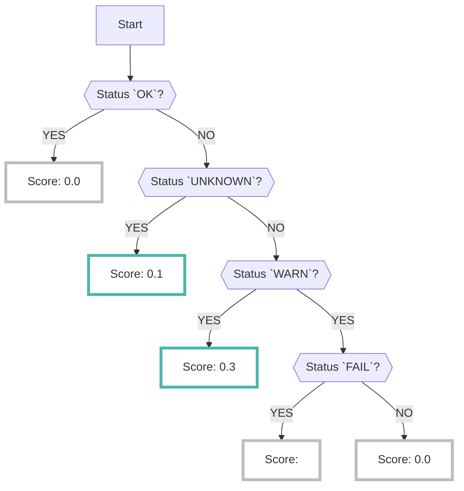

# CloudSploit

CloudSploitデータソースを有効にすると、オープンソースの[CloudSploit :octicons-link-external-24:](https://github.com/aquasecurity/cloudsploit){ target="_blank" } で解析された結果が収集されます

???+ help "CloudSploitとは？"
    - CloudSploitは[AquaSecurity :octicons-link-external-24:](https://www.aquasec.com/){ target="_blank" } が公開しているオープンソースの[CSPM :octicons-link-external-24:](https://www.checkpoint.com/cyber-hub/cloud-security/what-is-cspm-cloud-security-posture-management/){ target="_blank" } ツールです
    - CloudSploitでどのような項目が検知されるかは[GitHub :octicons-link-external-24:](https://github.com/aquasecurity/cloudsploit/tree/master/plugins/aws){ target="_blank" }を参照してください

## フォーマット

RISKENへデータを取り込む際に、以下のメタデータを付加します

| 項目            | 説明                                                      |
| -------------- | -----------------------------------------                 |
| `DataSource`   | aws:cloudsploit (固定)                                     |
| `ResourceName` | 検出したリソースのARN                                        |
| `Description`  | 説明                                                       |
| `Score`        | [スコアリング](/aws/cloudsploit#_2)参照                      |
| `Tag`          | `aws` `cloudspoit` `{AWSのサービス}` `{コンプライアンスマーク}` |

## スコアリング

- CloudSploitの解析結果にはスコア情報に相当するデータは含まれていません
- 各種チェック項目（プラグイン）に対して`PASS`（リスクなし）、もしくは `FAIL` （問題あり）といった[ステータス情報 :octicons-link-external-24:](https://github.com/aquasecurity/cloudsploit/blob/master/docs/writing-plugins.md#result-codes){ target="_blank" }のみ確認できます

    ??? Info "CloudSploitのステータス"
        - 0: PASS: リスクなし
        - 1: WARN: 設定ミスの可能性があります。または、問題はありますが、すぐに対応が必要なものではありません。
        - 2: FAIL: リスクあり
        - 3: UNKNOWN: （IAMの権限不足などで）API実行に失敗し正常に終了しませんでした

- しかし、これでは各チェック項目がそれぞれどの程度のリスクなのか判断が難しく、全てを見ようとすると大量のアラートをチェックしていく必要が出てしまいます
- なのでRISKENに取り込む際に、以下のロジックによってスコアリングを行い、優先して確認すべき問題を精査しています（詳細は[プラグインごとのスコア判定](/aws/cloudsploit/#_3)を確認してください）
    - ＊もちろん全ての `FAIL` を確認しても問題ありません

## プラグインごとのスコア判定

[CloudSploitの各種チェック項目（プラグイン） :octicons-link-external-24:](https://github.com/aquasecurity/cloudsploit/tree/master/plugins/aws){ target="_blank" } で `FAIL` 判定された場合、どのプラグインかによってスコアが変わります

また、プラグインによってCISやPCIDSSなどのコンプライアンス基準のタグが付与されます

＊下記以外のプラグインはすべてスコア `0.3`が付与されます

|Category|Plugin|Score|Compliance Tag|
|---|---|---|---|
|ACM|acmCertificateExpiry|6.0|pci|
|CloudTrail|cloudtrailEnabled|8.0|hipaa,pci,cis1,cis|
|EC2|ebsSnapshotPublic|8.0||
|EC2|openAllPortsProtocols|8.0|hipaa,pci|
|IAM|rootAccessKeys|8.0|hipaa,cis1,cis|
|IAM|rootAccountInUse|6.0|hipaa,pci,cis1,cis|
|IAM|rootMfaEnabled|8.0|pci,cis1,cis|
|Lambda|lambdaPublicAccess|6.0||
|RDS|rdsEncryptionEnabled|6.0|hipaa,pci|
|RDS|rdsPubliclyAccessible|8.0|hipaa,pci|
|Redshift|redshiftEncryptionEnabled|6.0|hipaa|
|Redshift|redshiftPubliclyAccessible|8.0|hipaa,pci|
|Route53|danglingDnsRecords|6.0||
|Route53|domainExpiry|8.0||
|S3|bucketAllUsersAcl|6.0|pci|
|S3|bucketAllUsersPolicy|6.0|pci|
|SageMaker|notebookDirectInternetAccess|6.0||
|SQS|sqsPublicAccess|6.0||