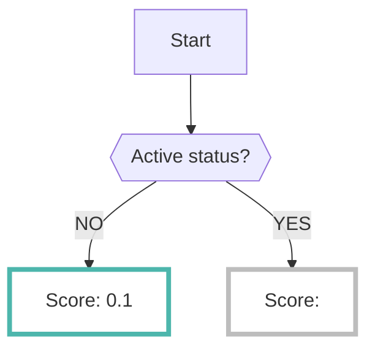

# GuardDuty

By enabling the GuardDuty data source, you can collect the results analyzed by [GuardDuty :octicons-link-external-24:](https://docs.aws.amazon.com/guardduty/latest/ug/what-is-guardduty.html){ target="_blank" } in AWS.

???+ tip "What is GuardDuty?"
    - AWS GuardDuty is a security service for threat detection provided by AWS.
    - Refer to the [official documentation :octicons-link-external-24:](https://docs.aws.amazon.com/guardduty/latest/ug/guardduty_finding-types-active.html){ target="_blank" } for the supported services in GuardDuty.

---

## Format

When importing data to RISKEN, the following metadata is added:

| Field           | Description                                           |
| --------------- | ------------------------------------------------------|
| `DataSource`    | aws:guard-duty (fixed)                                 |
| `ResourceName`  | GuardDuty Finding ARN                                 |
| `Description`   | Description                                            |
| `Score`         | See [Scoring :octicons-link-external-24:](https://docs.aws.amazon.com/guardduty/latest/ug/guardduty_findings.html){ target="_blank" } in GuardDuty documentation |
| `Tag`           | `aws` `guard-duty` `{type}` `{account ID}`             |

---

## Scoring

GuardDuty has a default scoring based on Severity (1.0 to 10.0). Therefore, this value is standardized to RISKEN's scoring range of `0.0` to `1.0` and imported.

