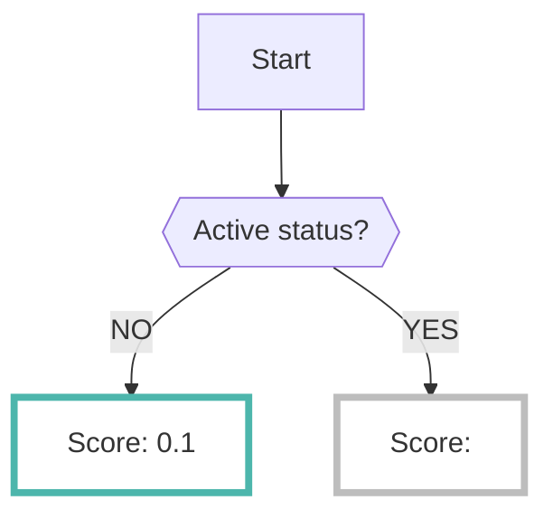

# GuardDuty

GuardDutyデータソースを有効にすると、AWSの[GuardDuty](https://docs.aws.amazon.com/guardduty/latest/ug/what-is-guardduty.html)で分析された結果を収集保存されます

- AWS GuardDutyは、驚異検知に有効なセキュリティサービスです
- GuardDutyでサポートされているサービス等については[公式ドキュメント](https://docs.aws.amazon.com/guardduty/latest/ug/guardduty_finding-types-active.html)を参照してください

---

## フォーマット

RISKENへデータを取り込む際に、以下のメタデータを付加します

| 項目            | 説明                                      |
| -------------- | ---------------------------------------- |
| `DataSource`   | aws:guard-duty (固定)                      |
| `ResourceName` | GuardDutyのFinding ARN                    |
| `Description`  | GuardDutyのDescription                     |
| `Score`        | [スコアリング](/aws/guardduty/#_2)参照       |
| `Tag`          | `aws` `admin-checker` `{タイプ}`           |

---

## スコアリング

- GuarDutyは[Severity（1.0 ~ 10.0）によるスコアリング](https://docs.aws.amazon.com/guardduty/latest/ug/guardduty_findings.html)が元から設定されています。
- なので、その値をRISKENのスコア範囲 `0.0 ~ 1.0` に標準化し取り込みます

