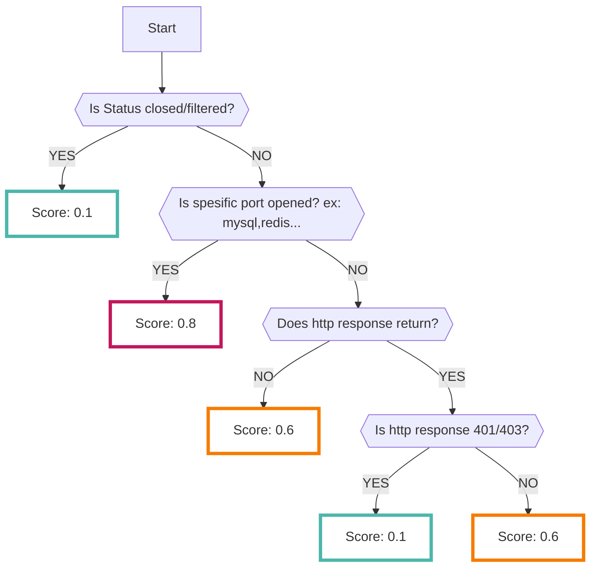

# PortScan

Perform a port scan using [Nmap :octicons-link-external-24:](https://nmap.org/man/ja/index.html){ target="_blank" } towards the ports publicly exposed to the outside world, such as AWS instances and security group information, and import the results into RISKEN's findings.

## Format

The following metadata is added when importing data into RISKEN:

| Item          | Description                                      |
| ------------- | ------------------------------------------------ |
| `DataSource`  | aws:portscan (fixed)                              |
| `ResourceName`| ARN of the resource to be scanned                 |
| `Description` | Description                                       |
| `Score`       | Refer to [Scoring](/aws/portscan/#_2)             |
| `Tag`         | `aws` `portscan` `{AWS service}` `{account ID}`   |

## Scoring

The scoring is performed based on the status of the scan result [status](/aws/portscan/#_3), the port being scanned, and the HTTP response obtained when accessed.

Additionally, [additional confirmation](/aws/portscan/#_4) is performed if it is confirmed that the port is open and that services such as HTTP and SSH are running.

## Status

The status of the port scan results using Nmap can have the following:

There may be differences in the meaning of the results depending on the TCP/UDP scan, but generally, a higher score is given for open status.

    - open: Port is open
    - filtered: It is unknown whether the port is open or closed
    - closed: Port is closed

## Additional confirmation

If it is confirmed that a specific service is running based on the Nmap result, the following checks are added:

If the following checks apply, the score is set to `0.8`, and a finding is registered separately from the Nmap result.

- SSH
    - Password authentication is enabled.
- HTTP
    - Can be used as a public proxy.
- SMTP
    - Open relay for mail server is enabled.
