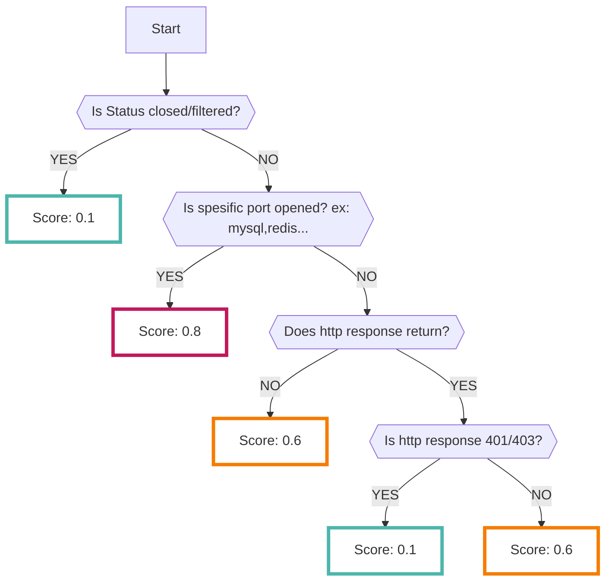

# PortScan

AWSのインスタンス、セキュリティグループ情報等から外部に公開されているポートに向けて[Nmap :octicons-link-external-24:](https://nmap.org/man/ja/index.html){ target="_blank" } によるポートスキャンを行い、その結果をRISKENのFindingへ取り込むことが可能です

## フォーマット

RISKENへデータを取り込む際に、以下のメタデータを付加します

| 項目            | 説明                                            |
| -------------- | ------------------------------------------------|
| `DataSource`   | aws:portscan (固定)                              |
| `ResourceName` | スキャン対象のリソースのARN                         |
| `Description`  | 説明                                             |
| `Score`        | [スコアリング](/aws/portscan/#_2)参照               |
| `Tag`          | `aws` `portscan` `{AWSのサービス}` `{アカウントID}` |

## スコアリング

スキャン結果の[ステータス](/aws/portscan/#_3)、スキャン対象のポート、アクセスした結果のHTTPレスポンスにてスコアリングを行います。

また、ポートが開いておりHTTP,SSH等のサービスが動作していることを確認できた場合に[追加の確認](/aws/portscan/#_4)を行います。

## ステータス
Nmapによるポートスキャン結果のステータスには、以下のものが存在します

TCP,UDPのスキャンによって結果の意味が異なる場合がありますが、基本的にステータスがopenの場合にスコアが高くなります

    - open: ポートが開放されている状態
    - filtered: ポートが開放されているか閉じられているか判断がつかない状態
    - closed: ポートが閉じられている状態

## 追加の確認
Nmapの結果より特定のサービスが動いていることが確認できた場合、以下の確認を追加で行います。

下記のチェックに該当した場合、スコアは`0.8`として、Nmap結果とは別に追加でFindingが登録されます。

- SSH
    - パスワード認証が有効になっている
- HTTP
    - 公開プロキシとして利用可能になっている
- SMTP
    - メールサーバーのオープンリレーが有効になっている
