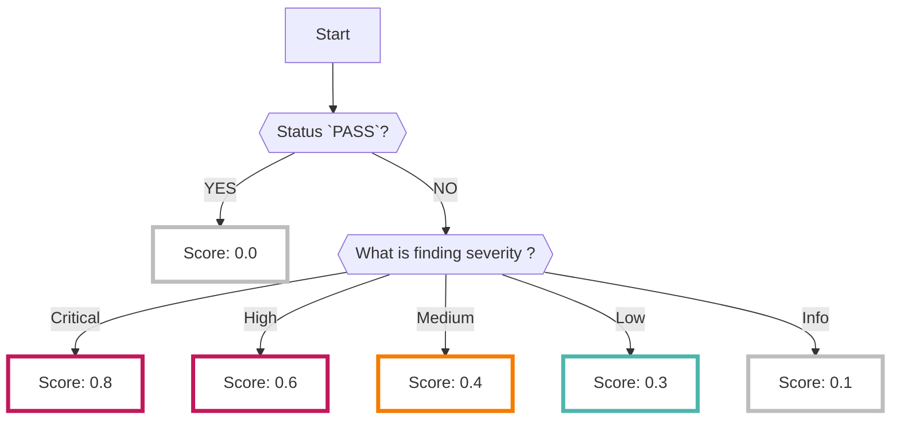

# Prowler

By enabling the Prowler data source, results analyzed by the open source [Prowler :octicons-link-external-24:](https://github.com/aquasecurity/prowler){ target="_blank" } will be collected.

???+ help "What is Prowler?"
    - Prowler is an open-source [CSPM :octicons-link-external-24:](https://docs.prowler.com/projects/prowler-open-source/en/latest/){ target="_blank" } tool published by [Prowler, Inc :octicons-link-external-24:](https://prowler.com/){ target="_blank" }.
    - For details on what items are detected by Prowler, refer to [GitHub :octicons-link-external-24:](https://github.com/prowler-cloud/prowler/tree/master/prowler/providers/azure/services){ target="_blank" }.

## Format

When importing data into RISKEN, the following metadata will be added:

| Item            | Description                                                      |
| -------------- | ---------------------------------------------------------------- |
| `DataSource`   | azure:prowler (fixed)                                            |
| `ResourceName` | ID of the detected resource                                      |
| `Description`  | Description                                                      |
| `Score`        | Refer to [Scoring](/azure/prowler/#_2)                           |
| `Tag`          | `azure` `prowler` `{Azure Service}` `{Subscription ID}` ` {Plugin Name}` |

## Scoring

- The analysis results from Prowler do not include data equivalent to score information.
- Only [status information :octicons-link-external-24:](https://docs.prowler.com/projects/prowler-open-source/en/latest/developer-guide/checks/#check-status){ target="_blank" } such as `PASS` (no risk) or `FAIL` (risk present) can be confirmed for each check item (plugin).

    ??? Info "Prowler Status"
        - 0: PASS: No risk
        - 1: FAIL: Risk present
        - 2: MANUAL: Manual verification required to determine PASS/FAIL (not used in Azure scans)

- It is difficult to determine the level of risk for each check item with this information alone, and attempting to review all of them would require checking a large number of alerts.
- Therefore, when importing into RISKEN, scoring is performed using the following logic to prioritize issues that should be reviewed first (for details, refer to [Score Determination per Plugin](/azure/prowler/#_3)).
    - *Of course, it is also acceptable to review all `FAIL` results.

