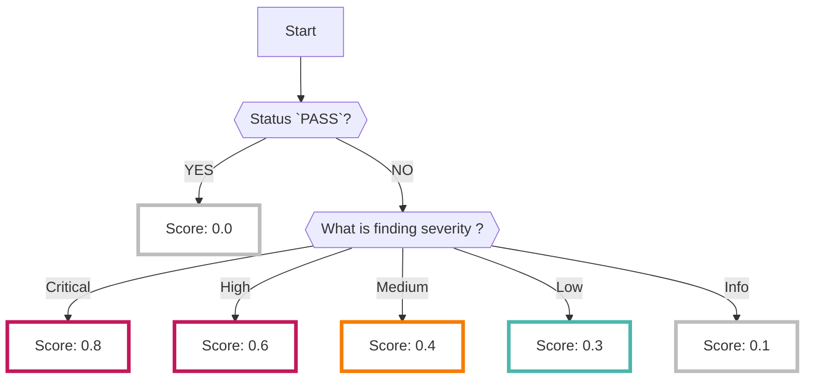

# Prowler

Prowlerデータソースを有効にすると、オープンソースの[Prowler :octicons-link-external-24:](https://github.com/prowler-cloud/prowler){ target="_blank" } で解析された結果が収集されます

???+ help "Prowlerとは？"
    - Prowlerは[Prowler, Inc :octicons-link-external-24:](https://prowler.com/){ target="_blank" } が公開しているオープンソースの[CSPM :octicons-link-external-24:](https://docs.prowler.com/projects/prowler-open-source/en/latest/){ target="_blank" } ツールです
    - Prowlerでどのような項目が検知されるかは[GitHub :octicons-link-external-24:](https://github.com/prowler-cloud/prowler/tree/master/prowler/providers/azure/services){ target="_blank" }を参照してください

## フォーマット

RISKENへデータを取り込む際に、以下のメタデータを付加します

| 項目            | 説明                                                      |
| -------------- | -----------------------------------------                 |
| `DataSource`   | azure:prowler (固定)                                     |
| `ResourceName` | 検出したリソースのID                                        |
| `Description`  | 説明                                                       |
| `Score`        | [スコアリング](/azure/prowler/#_2)参照                      |
| `Tag`          | `azure` `prowler` `{Azureのサービス}` `{Subscription ID}`　`{プラグイン名}`　`|

## スコアリング

- Prowlerの解析結果にはスコア情報に相当するデータは含まれていません
- 各種チェック項目（プラグイン）に対して`PASS`（リスクなし）、もしくは `FAIL` （問題あり）といった[ステータス情報 :octicons-link-external-24:](https://docs.prowler.com/projects/prowler-open-source/en/latest/developer-guide/checks/#check-status){ target="_blank" }のみ確認できます

    ??? Info "Prowlerのステータス"
        - 0: PASS: リスクなし
        - 1: FAIL: リスクあり
        - 2: MANUAL: PASS/FAILの判断のために、手動で確認が必要 (Azureのスキャンでは使用されません)

- これでは各チェック項目がそれぞれどの程度のリスクなのか判断が難しく、全てを見ようとすると大量のアラートをチェックしていく必要が出てしまいます
- なのでRISKENに取り込む際に、以下のロジックによってスコアリングを行い、優先して確認すべき問題を精査しています（詳細は[プラグインごとのスコア判定](/azure/prowler/#_3)を確認してください）
    - ＊もちろん全ての `FAIL` を確認しても問題ありません

