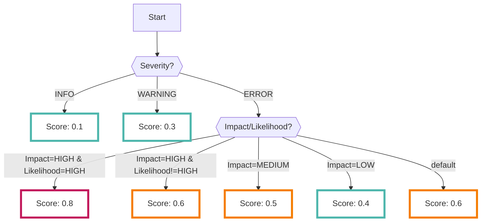

# CodeScan

You can continuously collect results analyzed with the open-source [Semgrep :octicons-link-external-24:](https://semgrep.dev/){ target="_blank" }.

???+ help "What is Semgrep?"
    - A tool designed for static analysis of source code.
    - It's particularly useful for detecting issues related to security, bugs, and code style violations.

## Format

When importing data into RISKEN, the following metadata is added:

| Field          | Description                                  |
| -------------- | -------------------------------------------- |
| `DataSource`   | code:codescan (fixed)                        |
| `ResourceName` | Repository name                              |
| `Description`  | Description                                  |
| `Score`        | Refer to [Scoring](/en/code/codescan_concept/#scoring) |
| `Tag`          | `code` `repository` `codescan` `{Repository Name}` |

---

## Scoring

Scores are set based on the results analyzed by CodeScan as follows:

- `Severity` represents the severity level of Semgrep rules (ERROR indicates high severity)
- `Impact` represents the degree of damage that a vulnerability could cause
- `Likelihood` represents the probability that an attacker could exploit the discovered issue

## Detection Rules

Scans are conducted based on the contents of the [Default Rules :octicons-link-external-24:](https://semgrep.dev/p/default){ target="_blank" } found in the Semgrep Registry. You can check the specific items that are inspected and the severity of each rule on the aforementioned Registry website.

