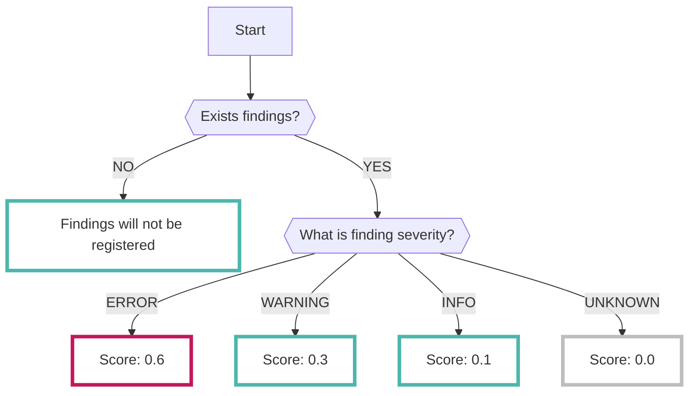

# CodeScan

オープンソースの[Semgrep :octicons-link-external-24:](https://semgrep.dev/){ target="_blank" }で分析した結果を継続的に収集することができます

???+ help "Semgrep とは？"
    - ソースコードの静的解析を行うためのツールです
    - 特に、セキュリティの問題やバグ、コードスタイルの違反などを検出するのに役立ちます

## フォーマット

RISKEN へデータを取り込む際に、以下のメタデータを付加します

| 項目           | 説明                                            |
| -------------- | ----------------------------------------------- |
| `DataSource`   | code:codescan (固定)                            |
| `ResourceName` | リポジトリ名                                    |
| `Description`  | 説明                                            |
| `Score`        | [スコアリング](/code/codescan_concept/#_2)参照  |
| `Tag`          | `code` `repository` `codescan` `{リポジトリ名}` |

---

## スコアリング

CodeScan で解析された結果をもとに以下の通りにスコアを設定します

## 検知ルール

Semgrep Registryにある [Default ルール :octicons-link-external-24:](https://semgrep.dev/p/default){ target="_blank" } の内容でスキャンが行われます。
どのような項目がチェックされるのかや各ルールの重大度の確認は上記のRegistryサイトで確認できます。
