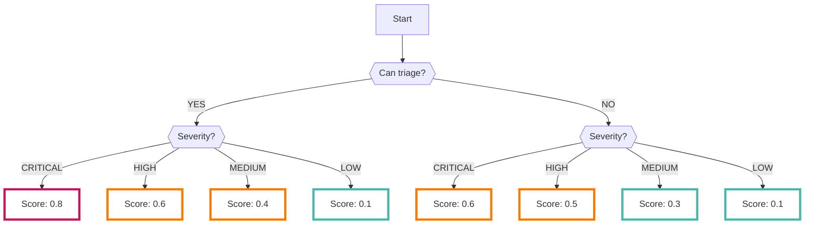

# Dependency

You can continuously collect the results analyzed by the open-source [Trivy :octicons-link-external-24:](https://github.com/aquasecurity/trivy){ target="_blank" } for various targets including container images, file systems, and Git repositories.

???+ help "What is Trivy?"
    - Trivy is a comprehensive security scanner for various targets including container images, file systems, and Git repositories.
    - The Dependency data source targets repositories on GitHub and investigates known vulnerabilities.

## Format

The following metadata is added when importing data to RISKEN:

| Field           | Description                                      |
| --------------- | ---------------------------------------------- |
| `DataSource`   | code:dependency (fixed)                            |
| `ResourceName` | The name of the package where the vulnerability was detected |
| `Description`  | Description                                      |
| `Score`        | Refer to [Scoring](/code/dependency_concept/#_2)             |
| `Tag`          | `code` `dependency` `repository_id:{RepositoryID}` |

* The `RepositoryID` in `Tag` should contain the ID of the repository that contains the package using the detected vulnerability.

---

## Scoring

Scoring is performed based on the severity of vulnerabilities in the result data analyzed by Trivy.

The scoring is based on the CVSS score.

## Triage

The [Auto-Triage](/en/risken/triage/) function of RISKEN may re-evaluate the score of the finding.

The process of automatic triage determines whether the detected vulnerability is exploitable and whether automation is present.
"Triageable" refers to a state where there is sufficient material for the process.

See [Auto-Triage](/en/risken/triage/) for details.
