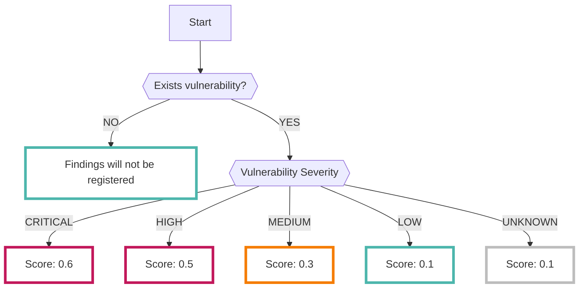

# Dependency

オープンソースの[Trivy :octicons-link-external-24:](https://github.com/aquasecurity/trivy){ target="_blank" }で分析した結果を継続的に収集することができます

???+ help "Trivyとは？"
    - コンテナイメージ、ファイルシステム、Gitリポジトリなどを対象とした総合的なセキュリティスキャナです
    - DependencyデータソースではGitHub上へのリポジトリを対象とし、既知の脆弱性を調査します

## フォーマット

RISKENへデータを取り込む際に、以下のメタデータを付加します

| 項目            | 説明                                            |
| -------------- | ---------------------------------------------- |
| `DataSource`   | code:dependency (固定)                            |
| `ResourceName` | 脆弱性を検知したパッケージ名                           |
| `Description`  | 説明                                            |
| `Score`        | [スコアリング](/code/dependency_concept/#_2)参照             |
| `Tag`          | `code` `repository` `dependency` `repository_id:{RepositoryID}` |

* `Tag`の`RepositoryID`には、検知した脆弱性を使用しているパッケージが含まれるリポジトリのIDが入ります

---

## スコアリング

Trivyで解析された結果データの脆弱性の重大度に応じてスコアリングを行います。

