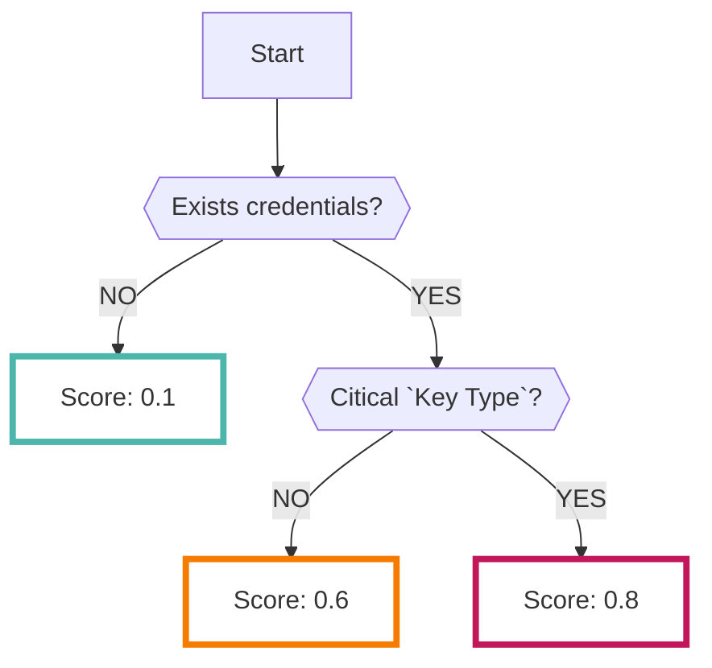

# Gitleaks

オープンソースの[Gitleaks](https://github.com/zricethezav/gitleaks)で分析した結果を継続的に収集することができます

???+ help "Gitleaksとは？"
    - `シークレットスキャンニング` と呼ばれるツールの一種です
    - GitHub上のリポジトリに対して通常コミットしてはいけないクレデンシャルが含まれてないかをスキャンできます
    - `Organization` や `User` を指定して、その配下のリポジトリを分析します
    - 設定によってどの種類のリポジトリをスキャンするかの指定が可能です。（詳細は下記を参照）

## データソース

Gitleaksのデータソース設定について説明します

**※注意: 他者の環境に対してスキャンはNGです（発見した場合、強制的にデータ削除する可能性があります）**

1. メニューより`Code > Gitleaks`をクリックします
2. 画面右側の`NEW`をクリックします
3. 以下の項目を入力し`EDIT`をクリックしてください
    - **Name ＊**: Gitleaks設定名
    - **Type ＊**: GitHubの種類 `Organization`または`User`を指定します
    - **TargetResouce ＊**: GitHubのOrganization名またはUser名を入力します
    - **RepositoryPattern**: 上記のTargetResource配下でスキャンしたいリポジトリ名を指定します。（部分一致）
        - 空欄の場合は、TargetResource配下のリポジトリすべてが対象になります。
    - **GitHubUser**: スキャンする際の認証情報（ユーザ名）を登録します
    - **PersonalAccessToken（PAT）**: スキャンする際の認証情報（Token）を登録します
        - 認証情報を登録しない場合はInternal／Privateリポジトリのスキャンはできません。
        - 認証情報はRISKEN上で暗号化して保存されます
        - 認証情報登録後に設定済みのTokenは閲覧できません（xxxxのようなマスク値で表示されます）
    - **リポジトリの可視性**: スキャン対象にする[可視性](https://docs.github.com/en/github/creating-cloning-and-archiving-repositories/about-repository-visibility)を選択してください（Internal／Privateを対象にする場合はPATの登録が必要です）
        - `Public`: インターネットに公開されているリポジトリをスキャンします
        - `Internal`: Enterpris内のリポジトリをスキャンします
        - `Private`: プライベートリポジトリをスキャンします
    - {style="width:500px"}

???+ warning "Limitation"
    以下の条件に該当するリポジトリはスキャン対象外になります

    - リポジトリのステータスが以下のもの
        - `Archived`
        - `Disabled`
        - `Forkリポジトリ`
            - ＊[Forkリポジトリ](https://docs.github.com/en/github/getting-started-with-github/fork-a-repo)とは一般的にはオリジナルリポジトリへの貢献（修正の提案）のために作成されるリポジトリです
    - リポジトリのサイズが350MB以上のもの
    - RISKEN環境からcloneできないもの

## スキャン

データソース設定が完了したら、実際にスキャンできるかを確認します

1. メニューより`Code > Gitleaks`をクリックします
2. Gitleaks一覧をクリックし設定済みのデータソースダイアログを開きます
3. 画面左下の`Scan`をクリックします
4. Statusが`OK`となればデータ連携成功です（※エラー表示時はダイアログにエラーメッセージが表示されます）
    - {style="width:400px"}
    - データソースが収集したFindingデータは `Finding > Finding` で確認することができます
5. 上記のように手動スキャンの他に連携済みのDataSourceは定期的に（日次）スケジュール実行されます

## フォーマット

RISKENへデータを取り込む際に、以下のメタデータを付加します

| 項目            | 説明                                            |
| -------------- | ---------------------------------------------- |
| `DataSource`   | code:gitleaks (固定)                            |
| `ResourceName` | リポジトリ名                                     |
| `Description`  | 説明                                            |
| `Score`        | [スコアリング](/code/gitleaks#_4)参照             |
| `Tag`          | `code` `gitleaks` `{visibillity}` `{key-type}` |

---

## スコアリング

Gitleaksで解析された結果データにはスコアに相当するデータを持っていません

なので、RISKENでは[キータイプ](/code/gitleaks#_5)ごとのリスクを加味してスコアリングしています

???+ help "Gitleaksのルールセット"
    - Gitleaksはオープンソースなので、[ルールセット](https://github.com/zricethezav/gitleaks/blob/master/config/default.go)も公開されています
    - この中で特に危険と判断されるキーが保存されていた場合はスコアが高くなります

※クレデンシャルが存在しない場合でも低スコアのFindingデータが生成されます

## クリティカルなキータイプ

RISKENでは以下のキータイプが `Critical` と判定されます

- AWS Access Key
- AWS Secret Key
- AWS MWS key
- Google (GCP) Service Account
- Heroku API key
- MailChimp API key
- Mailgun API key
- PayPal Braintree access token
- Picatic API key
- SendGrid API Key
- Stripe API key
- Square access token
- Square OAuth secret
- Twilio API key
- Dynatrace ttoken
- Shopify shared secret
- Shopify access token
- Shopify custom app access token
- Shopify private app access token

???+ tip "全てのキータイプを確認するには？"
    Gitleaksの[ルールセット](https://github.com/zricethezav/gitleaks/blob/master/config/default.go)を確認してください。

    ルールセットの `Description` 項目がRISKEN上のキータイプと紐づきます
