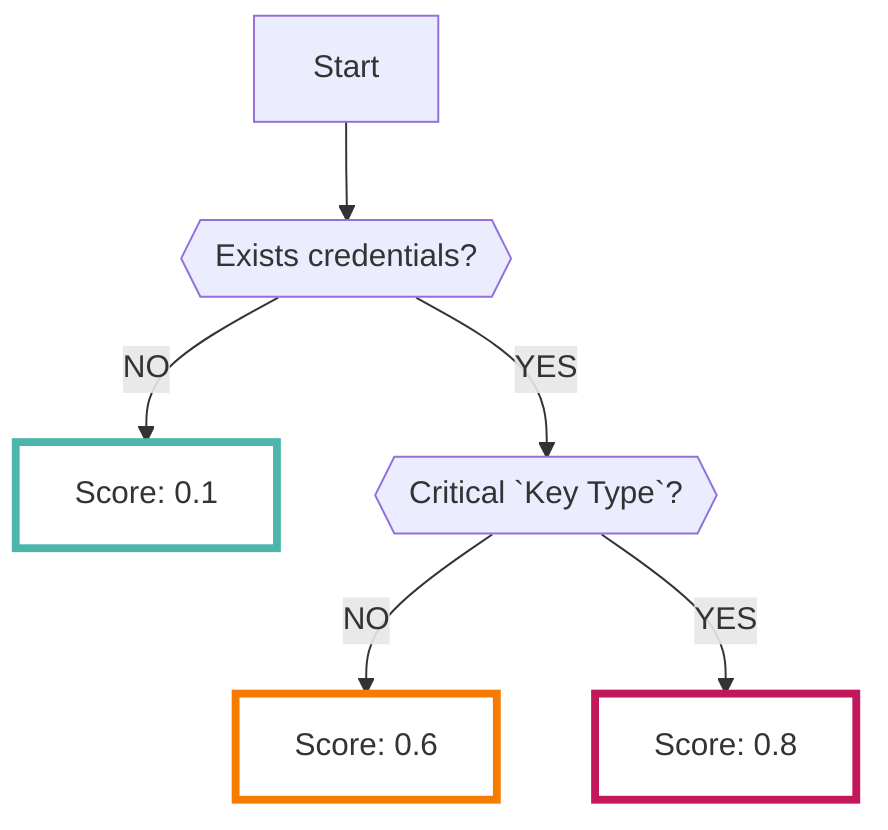

# Gitleaks

You can continuously collect the results analyzed by the open-source [Gitleaks :octicons-link-external-24:](https://github.com/zricethezav/gitleaks){ target="_blank" } tool.

???+ help "What is Gitleaks?"
    - Gitleaks is a type of tool called `secret scanning`.
    - It can scan GitHub repositories for credentials that should not be normally committed.
    - It analyzes repositories under specified `Organization` or `User`.
    - The types of repositories to scan can be specified in the settings. (See below for details.)

## Format

When importing data into RISKEN, the following metadata is added:

| Item           | Description                                           |
| -------------- | ----------------------------------------------------- |
| `DataSource`   | code:gitleaks (fixed)                                 |
| `ResourceName` | Repository name                                       |
| `Description`  | Description                                           |
| `Score`        | Refer to [Scoring](/code/gitleaks_concept/#_2)        |
| `Tag`          | `code` `repository` `gitleaks` `{Repository Name}` `{Visibility}` `{Key Type}` |

---

## Scoring

The result data analyzed by Gitleaks does not have data equivalent to the score.

Therefore, RISKEN considers the risk for each [key type](/code/gitleaks_concept/#_3) and scores accordingly.

???+ help "Gitleaks Rule Set"
    - Gitleaks is open source, so the [rule set :octicons-link-external-24:](https://github.com/zricethezav/gitleaks/blob/master/config/gitleaks.toml){ target="_blank" } is also available.
    - If a key that is particularly dangerous is found in this set, the score will be high.

* Note that low score Finding data is generated even if no credentials exist.

## Critical Key Types

The following key types are determined to be `Critical` in RISKEN:

- AWS Access Key
- AWS Secret Key
- AWS MWS key
- Google (GCP) Service Account
- Heroku API key
- MailChimp API key
- Mailgun API key
- PayPal Braintree access token
- Picatic API key
- SendGrid API Key
- Stripe API key
- Square access token
- Square OAuth secret
- Twilio API key
- Dynatrace ttoken
- Shopify shared secret
- Shopify access token
- Shopify custom app access token
- Shopify private app access token

???+ tip "How to check all key types?"
    Please check the Gitleaks [rule set :octicons-link-external-24:](https://github.com/zricethezav/gitleaks/blob/master/config/gitleaks.toml){ target="_blank" }
