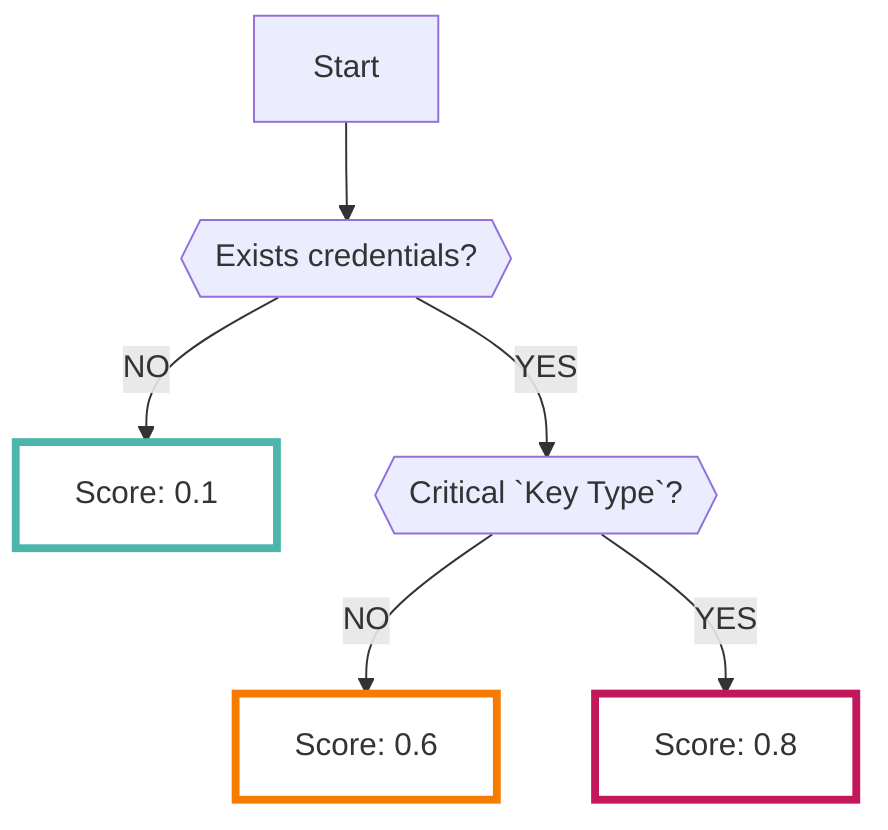

# Gitleaks

オープンソースの[Gitleaks :octicons-link-external-24:](https://github.com/zricethezav/gitleaks){ target="_blank" }で分析した結果を継続的に収集することができます

???+ help "Gitleaksとは？"
    - `シークレットスキャンニング` と呼ばれるツールの一種です
    - GitHub上のリポジトリに対して通常コミットしてはいけないクレデンシャルが含まれてないかをスキャンできます
    - `Organization` や `User` を指定して、その配下のリポジトリを分析します
    - 設定によってどの種類のリポジトリをスキャンするかの指定が可能です。（詳細は下記を参照）

## フォーマット

RISKENへデータを取り込む際に、以下のメタデータを付加します

| 項目            | 説明                                            |
| -------------- | ---------------------------------------------- |
| `DataSource`   | code:gitleaks (固定)                            |
| `ResourceName` | リポジトリ名                                     |
| `Description`  | 説明                                            |
| `Score`        | [スコアリング](/code/gitleaks#_4)参照             |
| `Tag`          | `code` `gitleaks` `{visibillity}` `{key-type}` |

---

## スコアリング

Gitleaksで解析された結果データにはスコアに相当するデータを持っていません

なので、RISKENでは[キータイプ](/code/gitleaks#_5)ごとのリスクを加味してスコアリングしています

???+ help "Gitleaksのルールセット"
    - Gitleaksはオープンソースなので、[ルールセット :octicons-link-external-24:](https://github.com/zricethezav/gitleaks/blob/master/config/default.go){ target="_blank" } も公開されています
    - この中で特に危険と判断されるキーが保存されていた場合はスコアが高くなります

※クレデンシャルが存在しない場合でも低スコアのFindingデータが生成されます

## クリティカルなキータイプ

RISKENでは以下のキータイプが `Critical` と判定されます

- AWS Access Key
- AWS Secret Key
- AWS MWS key
- Google (GCP) Service Account
- Heroku API key
- MailChimp API key
- Mailgun API key
- PayPal Braintree access token
- Picatic API key
- SendGrid API Key
- Stripe API key
- Square access token
- Square OAuth secret
- Twilio API key
- Dynatrace ttoken
- Shopify shared secret
- Shopify access token
- Shopify custom app access token
- Shopify private app access token

???+ tip "全てのキータイプを確認するには？"
    Gitleaksの[ルールセット :octicons-link-external-24:](https://github.com/zricethezav/gitleaks/blob/master/config/default.go){ target="_blank" }を確認してください。

    ルールセットの `Description` 項目がRISKEN上のキータイプと紐づきます
