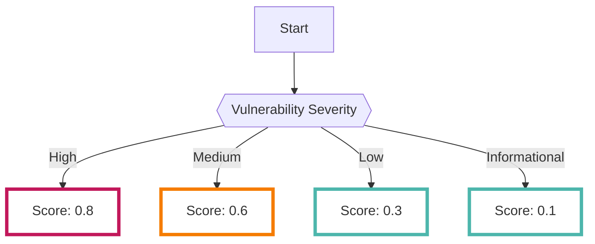

# ApplicationScan

Performs dynamic vulnerability scans of web applications using [OWASP ZAP :octicons-link-external-24:](https://www.zaproxy.org/){ target="_blank" }.

---
## Format

When importing data into RISKEN, the following metadata is added:

| Field          | Description                                     |
| -------------- | ----------------------------------------------- |
| `DataSource`   | diagnosis:applicationscan (fixed)               |
| `ResourceName` | URL of the scanned web application              |
| `Description`  | Detected vulnerabilities and URL of the scan target |
| `Score`        | See [Scoring](/diagnosis/applicationscan_concept/#_2) |
| `Tag`          | `diagnosis` `url` `application-scan` `vulnerability` `application_scan_id:{ApplicationScanID}` |

* `ApplicationScanID` in `Tag` is the ID assigned when setting up a scan on the ApplicationScan registration screen.

---
## Scoring

In the result data analyzed by the vulnerability scanner, scoring is performed based on the severity of the vulnerabilities.

The following is an example of scoring for vulnerabilities and their detection:
- `0.8 (High)`: Particularly dangerous vulnerabilities such as SQL Injection, OS Command Injection, and Cross Site Scripting are classified.
- `0.6 (Medium)`: Vulnerabilities that are less severe than a score of 0.8, such as the absence of security headers, are classified.
- `0.3 (Low)`: Vulnerabilities such as the exposure of software information and the absence of cookie attributes (Secure, Httponly) are classified.
- `0.1 (Informational)`: In addition to the above, information that is not highly severe is classified.

