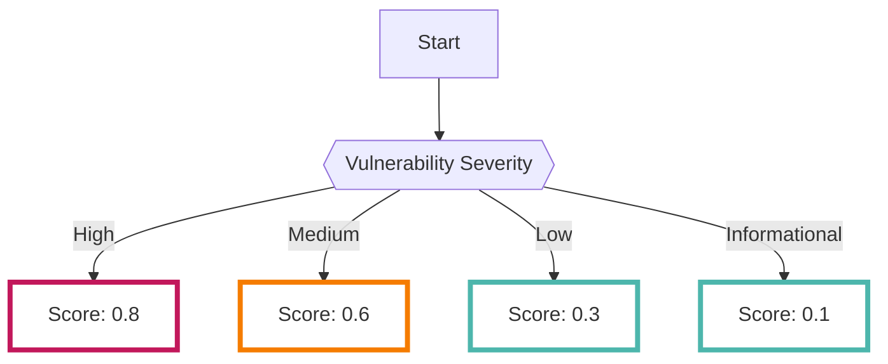

# ApplicationScan

Webアプリケーションの動的な脆弱性スキャンを[OWASP ZAP :octicons-link-external-24:](https://www.zaproxy.org/){ target="_blank" }にて実行します。

---
## フォーマット

RISKENへデータを取り込む際に、以下のメタデータを付加します

| 項目            | 説明                                            |
| -------------- | ---------------------------------------------- |
| `DataSource`   | diagnosis:applicationscan (固定)                |
| `ResourceName` | スキャン対象のURL                                         |
| `Description`  | 検知された脆弱性とスキャン対象のURL         　                |
| `Score`        | [スコアリング](/diagnosis/applicationscan_concept/#_2)参照            |
| `Tag`          | `diagnosis` `application-scan` `vulnerability` (全て固定)  |

---
## スコアリング

脆弱性スキャナにより解析された結果データでは、脆弱性の重大度に応じてスコアリングを行います。

以下に脆弱性とその脆弱性を検知した際のスコアリングの一例を記載します。
- `0.8 (High)`: SQL Injection,OS Command InjectionやCross Site Scriptingなどの特に危険な脆弱性が分類されます
- `0.6 (Medium)`: スコア0.8よりも危険度が低い脆弱性やセキュリティヘッダの欠如などが分類されます
- `0.3 (Low)`: ソフトウェア情報の露呈やCookieの属性(Secure,Httponly)の欠如などが分類されます
- `0.1 (Informational)`: 上記の他、重大度の高くない情報が分類されます

