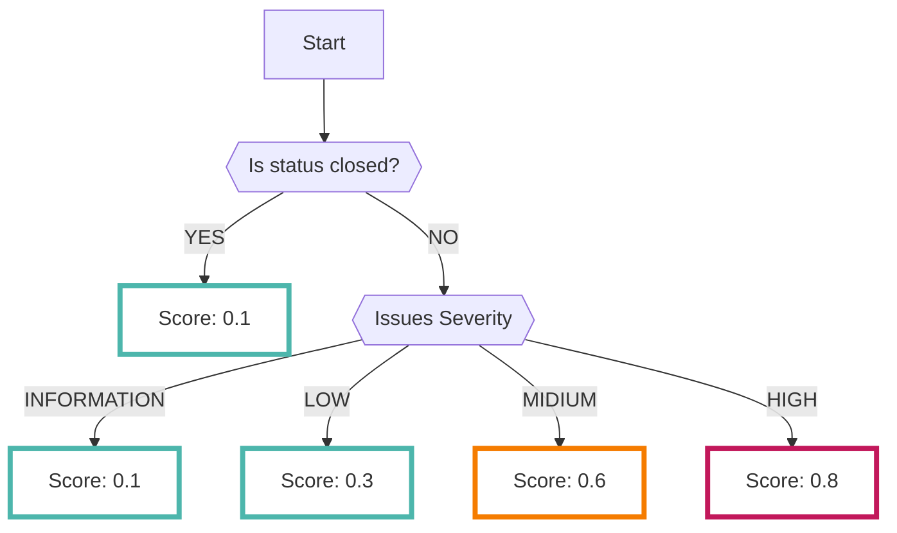

# JIRA

脆弱性診断のチケット管理を[JIRA :octicons-link-external-24:](https://www.atlassian.com/ja/software/jira){ target="_blank" } 上で行っている場合に、RISKENのFindingへ取り込むことが可能です

## フォーマット

RISKENへデータを取り込む際に、以下のメタデータを付加します

| 項目            | 説明                                            |
| -------------- | ---------------------------------------------- |
| `DataSource`   | diagnosis:jira (固定)                           |
| `ResourceName` | Jiraに登録されたプロジェクト名                      |
| `Description`  | Jiraに登録された課題名(概ね脆弱性名となります)        |
| `Score`        | [スコアリング](/diagnosis/jira_concept/#_2)参照            |
| `Tag`          | `diagnosis` `jira` `vulnerability` (全て固定)    |

## スコアリング

Jiraに登録されているステータス、課題の優先度に応じたスコアリングを行います

優先度が高いほどスコアが高くなり、またステータスがクローズの場合にはスコアは低くなります

