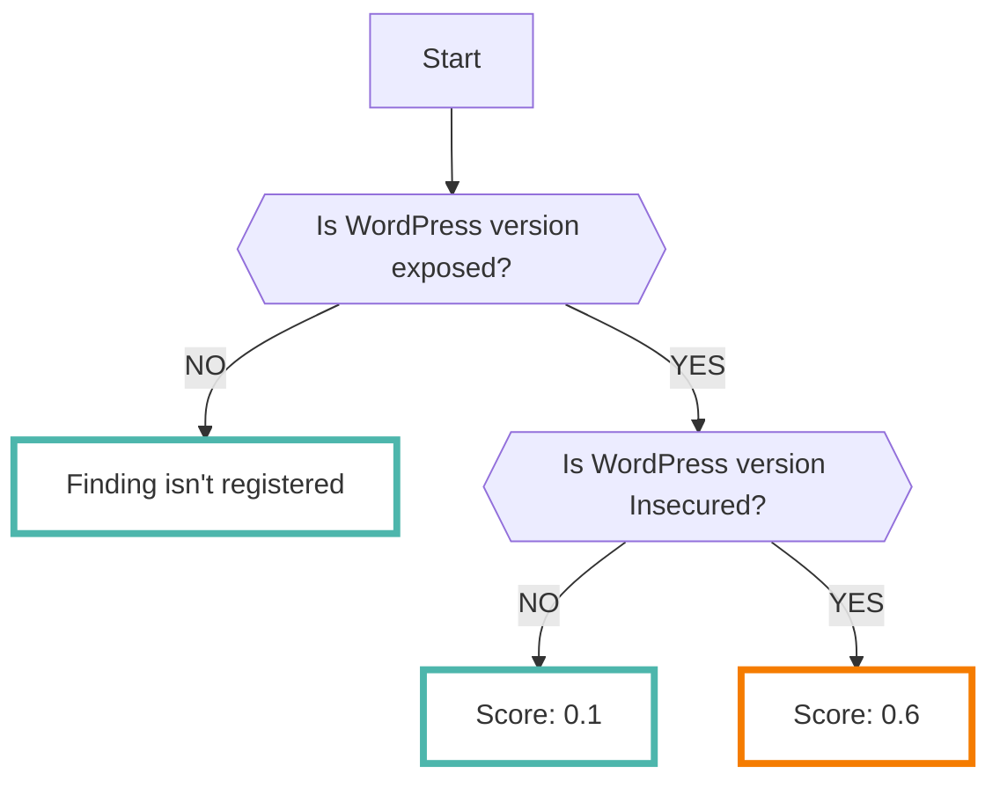
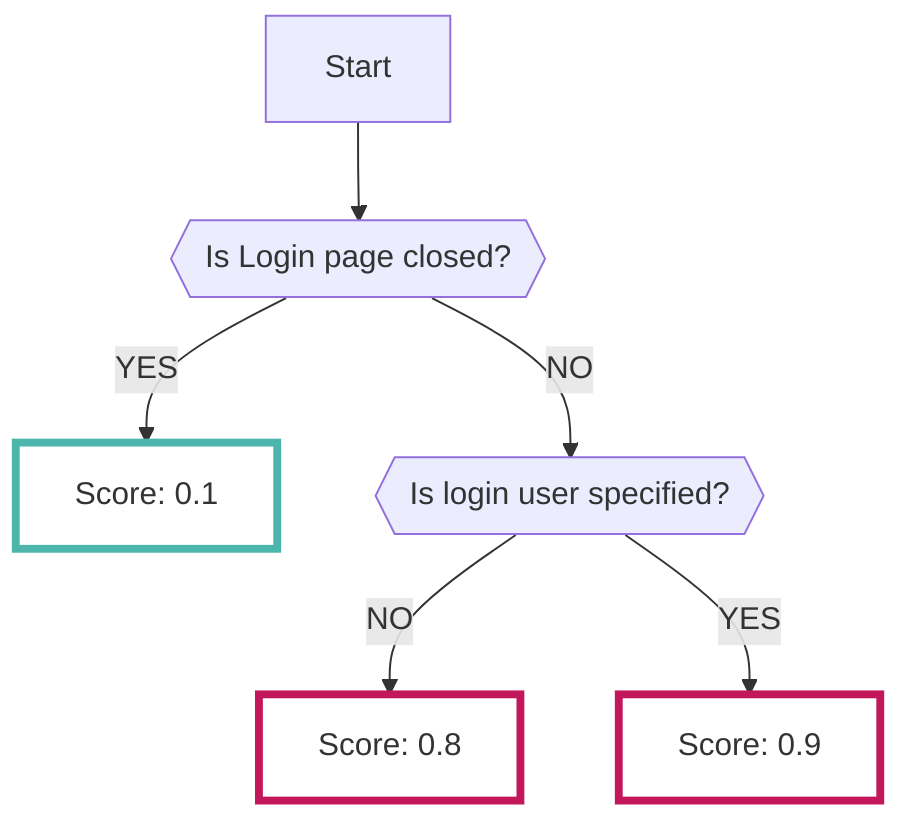

# WPScan

It is possible to import the results of a scan using [wpscan :octicons-link-external-24:](https://wordpress.org/plugins/wpscan/){ target="_blank" } into RISKEN.

???+ help "What is WPScan?"
    `wpscan` is a tool used to check if a WEB site built with WordPress has the following problems:

    - Configuration issues
    - Using old versions of plugins

    In addition to checking with `wpscan`, it checks if pages for administrators, such as the login page, are not exposed externally.

---
## Format

The following metadata is added when importing data into RISKEN:

| Item           | Description                                      |
| -------------- | ------------------------------------------------ |
| `DataSource`   | diagnosis:wpscan (fixed)                         |
| `ResourceName` | URL of the scan target                              |
| `Description`  | Description                                      |
| `Score`        | Refer to [Scoring](/diagnosis/wpscan_concept/#_2) |
| `Tag`          | `diagnosis` `wordpress` `vulnerability` `{Scan Target}`  |

---
## Scoring

The result data analyzed by WPScan does not contain data equivalent to scores.

Therefore, RISKEN performs scoring based on the collected content as follows:

### WordPress version information

The score is determined based on whether or not the version with vulnerabilities is used.

If version information cannot be obtained as a result of the scan, no Finding will be registered.

### Public availability of WordPress login page

The score is determined based on whether the login page is publicly available or not. Furthermore, if the login page is both public and the login user can be identified, the score will be even higher.

### Other information obtained through scanning

The following scores are given to the information that is judged to be of high severity among the results obtained by running WPScan:

- `0.8` Search Replace DB script is detected.
- `0.8` Access to debug.log is possible.
- `0.6` Access to readme.html is possible.
- `0.6` Access to backup-db directory is possible.
- `0.6` Full path to files can be confirmed from rss-functions.php.

Other information is registered with a score of `0.1` or `0.3`.

The following content is registered:

- `0.3` User information can be identified from external sources.
- `0.1` Files such as robots.txt can be referenced from external sources.
- `0.1` The information about plugins being used can be identified.
