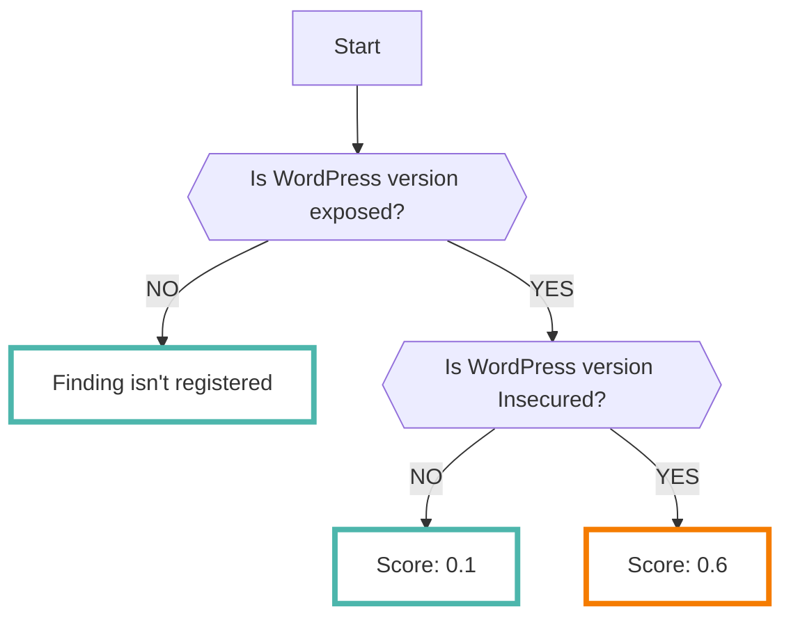
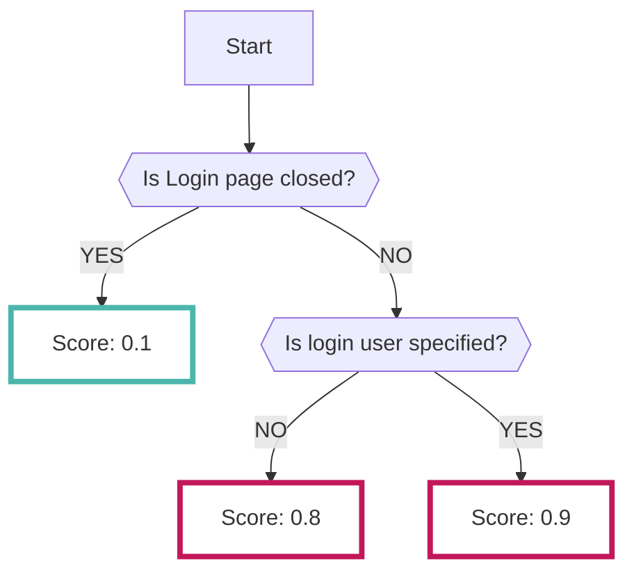

# WPScan

[wpscan :octicons-link-external-24:](https://wordpress.org/plugins/wpscan/){ target="_blank" }でスキャンした結果をRISKEN上へ取り込むことが可能です

???+ help "wpscanとは？"
    `wpscan` を使うとWordPressで構築されたWEBサイトに対して、以下のような問題がないかを確認することができます

    - 設定の問題
    - 古いバージョンのプラグインを利用している

    また、 `wpscan` による確認以外にログインページ等の管理者向けのページが外部に公開されていないかを確認します

---
## フォーマット

RISKENへデータを取り込む際に、以下のメタデータを付加します

| 項目            | 説明                                            |
| -------------- | ---------------------------------------------- |
| `DataSource`   | diagnosis:wpscan (固定)                         |
| `ResourceName` | スキャン対象のURL                                 |
| `Description`  | 説明                                            |
| `Score`        | [スコアリング](/diagnosis/wpscan_concept/#_2)参照            |
| `Tag`          | `diagnosis` `wordpress` `vulnerability` `{スキャン対象}`  |

---
## スコアリング

WPScanで解析された結果データにはスコアに相当するデータを持っていません

なので、RISKENでは収集した内容に応じて以下の通りにスコアリングを行います

### WordPressのバージョン情報

脆弱性の存在するバージョンかそうでないかでスコアを決定します

スキャンの結果バージョン情報を取得できなかった場合にはFindingは登録されません

### WordPressのログインページの公開

ログインページがパブリックに公開されているかどうかでスコアを判別しています

また、ログインページが公開かつログインユーザーを特定できる場合にはさらにスコアが高くなります

### スキャンにより得られたその他の情報

WPScanを実行した結果、上記以外の結果の中で危険度が高いと判断されたものは以下の通りのスコアとなります。

- `0.8` Search Replace DB のスクリプトが検知された
- `0.8` debug.log にアクセス可能である
- `0.6` readme.html にアクセス可能である
- `0.6` backup-db ディレクトリにアクセス可能である
- `0.6` rss-functions.phpからファイルのフルパスを確認可能である

上記以外の情報は `0.1`,`0.3` のスコアで登録されます

下記に該当するような内容が登録されます

- `0.3` ユーザー情報を外部から特定できる
- `0.1` robots.txt などのファイルが外部から参照できる
- `0.1` 使用しているプラグイン情報を特定できる
