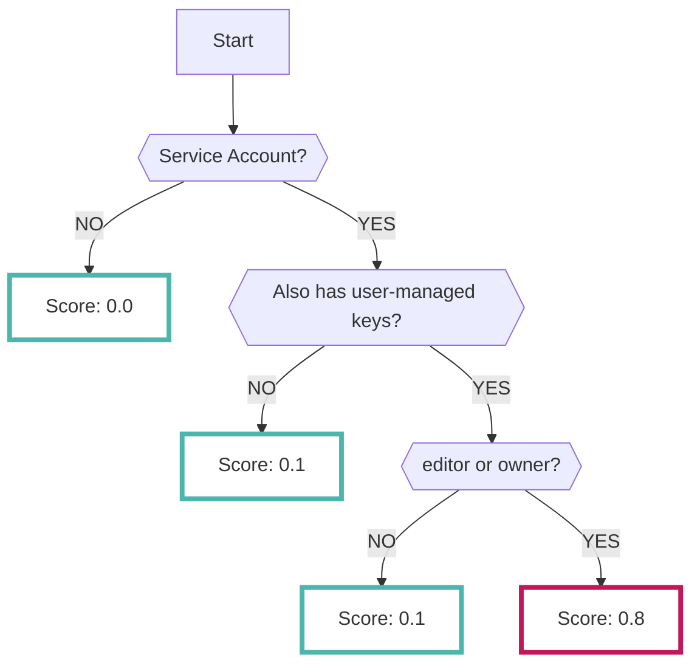
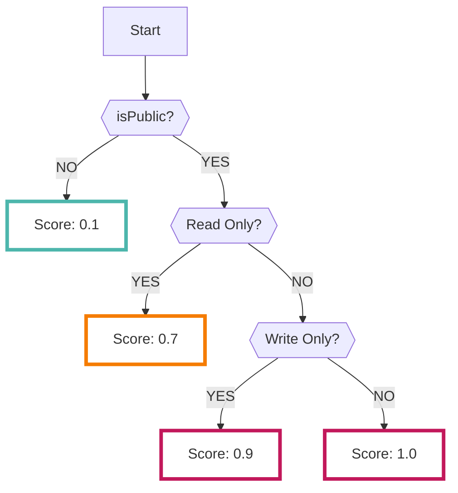

# Asset

Enabling the Asset data source collects results analyzed by the [Cloud Asset Inventory service :octicons-link-external-24:](https://cloud.google.com/asset-inventory/docs/overview){ target="_blank" } in GCP.

???+ help "What is Cloud Asset Inventory?"
    - Cloud Asset Inventory is a service that allows you to understand the asset information you have in your GCP project.
        - The assets you are using are stored as resource information in Cloud Asset Inventory.
    - In particular, the analysis results of the IAM policies used in GCP are used to detect privileged service accounts.
        - Data detected by this data source may not conform to [minimal best practices :octicons-link-external-24:](https://cloud.google.com/iam/docs/using-iam-securely){ target="_blank" }.

---

## Format

When importing data into RISKEN, the following metadata is added:

| Field          | Description                                |
| -------------- | ------------------------------------------ |
| `DataSource`   | google:asset (fixed)                       |
| `ResourceName` | Detected asset name                        |
| `Description`  | Description                                |
| `Score`        | See [Scoring](/google/asset/#_2)            |
| `Tag`          | `google` `gcp` `asset` `{type}` `{project ID}` |

---

## Scoring

Cloud Asset Inventory in GCP does not have scoring information.

Therefore, when importing data into RISKEN, the following logic is used to determine the severity and score the risk.

### Service Accounts

Service accounts with user-managed keys pose security risks such as leakage.
In addition, the logic has been implemented to increase the score as the bound roles become stronger.

### Cloud Storage

The score is calculated based on whether the storage bucket is publicly exposed and whether it allows not only read-only but also write access.

However, the following cases are not supported:

- Judgment of public status at the object level and policy analysis
- Policy analysis of custom roles.

