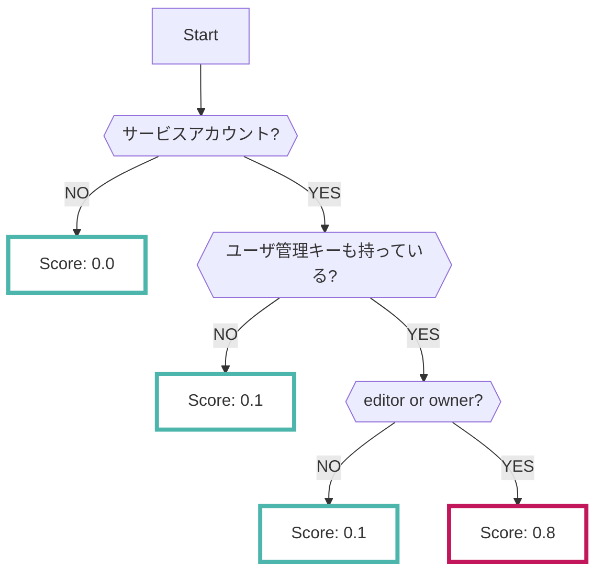

# Asset

Assetデータソースを有効にすると、GCPの[Cloud Asset Inventoryサービス](https://cloud.google.com/asset-inventory/docs/overview)で分析された結果が収集されます

???+ help "Cloud Asset Inventoryとは？"
    - Cloud Asset Inventoryは、自身のGCPプロジェクトで保有しているアセット情報を把握するのに便利なサービスです
        - 利用中のアセットはRISKENのリソース情報に保存されます
    - 特にGCPで利用しているIAMポリシーの解析結果により、特権サービスアカウントを検出します
        - このデータソースで検出されたデータは [必要最小限のベストプラクティス](https://cloud.google.com/iam/docs/using-iam-securely) に則っていない可能性があります

---

## フォーマット

RISKENへデータを取り込む際に、以下のメタデータを付加します

| 項目            | 説明                                      |
| -------------- | ---------------------------------------- |
| `DataSource`   | google:asset (固定)                       |
| `ResourceName` | 検出したアセット名                          |
| `Description`  | 説明                                      |
| `Score`        | [スコアリング](/google/asset#_2)参照        |
| `Tag`          | `gcp` `asset` `{タイプ}`                  |

---

## スコアリング

GCPのCloud Asset Inventoryはスコア情報を持っていません。

なので、RISKENに取り込む際に、以下のロジックによって危険度を判定しスコアリングしています。

