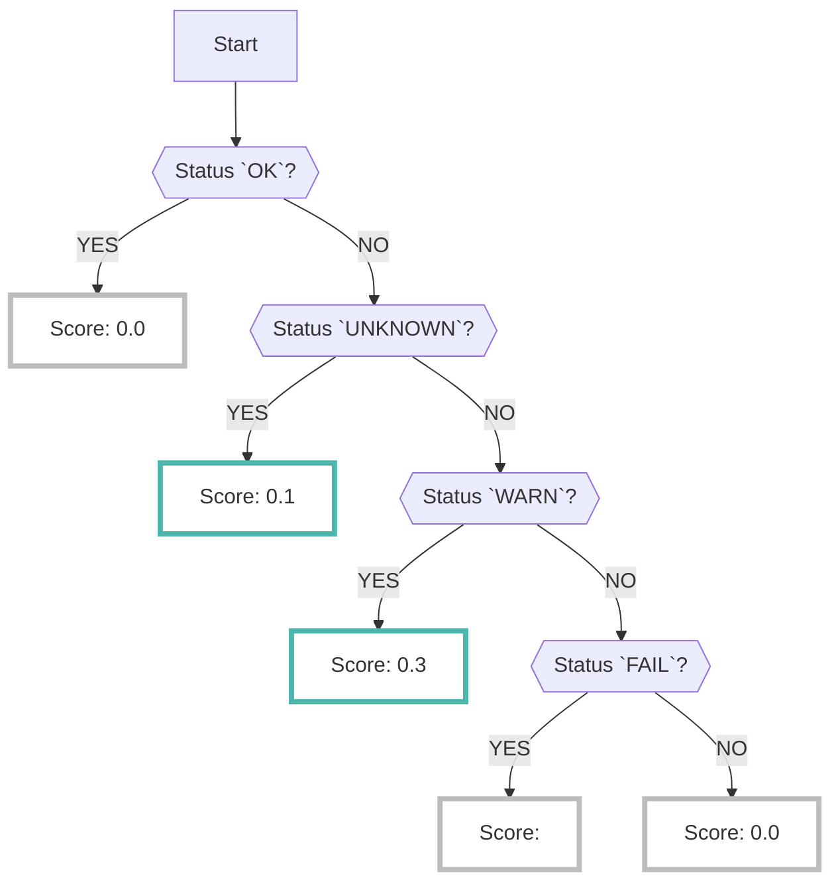

# CloudSploit

Enabling the CloudSploit data source collects the results of analysis done on [CloudSploit :octicons-link-external-24:](https://github.com/aquasecurity/cloudsploit){ target="_blank" }, an open-source tool developed by [AquaSecurity :octicons-link-external-24:](https://www.aquasec.com/){ target="_blank" }.

???+ help "What is CloudSploit?"
    - CloudSploit is an open-source [CSPM :octicons-link-external-24:](https://www.checkpoint.com/cyber-hub/cloud-security/what-is-cspm-cloud-security-posture-management/){ target="_blank" } tool published by [AquaSecurity :octicons-link-external-24:](https://www.aquasec.com/){ target="_blank" }.
    - Refer to the [GitHub :octicons-link-external-24:](https://github.com/aquasecurity/cloudsploit/tree/master/plugins/google){ target="_blank" } for a list of items detected by CloudSploit.

---

## Format

When importing data into RISKEN, the following metadata is added:

| Item          | Description                                               |
| ------------- | --------------------------------------------------------- |
| `DataSource`  | google:cloudsploit (fixed)                                |
| `ResourceName`| The name of the detected asset.                           |
| `Description` | Description                                               |
| `Score`       | Refer to [Scoring :octicons-link-external-24:](/google/cloudsploit/#_2) |
| `Tag`         | `google` `gcp` `cloudsploit` `{compliance mark}` `{project ID}` `{plugin name}` `{Well-Architected tag}` |

＊ Refer to the [/risken/well_architected](/risken/well_architected/) page for details on how to use the `Well-Architected` tag.

---

## Scoring

- CloudSploit's analysis results do not include score information.
- Only status information such as `PASS` (no risk) or `FAIL` (problem exists) for each check item (plugin) can be confirmed. Refer to [Result Codes :octicons-link-external-24:](https://github.com/aquasecurity/cloudsploit/blob/master/docs/writing-plugins.md#result-codes){ target="_blank" } for more information.

    ??? Info "CloudSploit Status"
        - 0: PASS: No risk
        - 1: WARN: There may be a setting mistake, or there is a problem, but it is not immediately necessary to respond.
        - 2: FAIL: There is risk
        - 3: UNKNOWN: (Failed to execute the API due to insufficient IAM permissions, etc.) 

- However, it is difficult to determine the level of risk for each check item and checking all alerts requires a large amount of effort.
- Therefore, when importing to RISKEN, scoring is performed based on the following logic to examine problems that should be prioritized (Refer to [Plugin scoring :octicons-link-external-24:](/google/cloudsploit/#_3) for details).
    - ＊Of course, it is also possible to check all `FAIL` results.

## Scoring by plugin

When a check item (plugin) in [CloudSploit](https://github.com/aquasecurity/cloudsploit/tree/master/plugins/google){:target="_blank"} is marked as `FAIL`, the score will depend on the plugin.

Additionally, compliance tags such as CIS and PCIDSS are attached to the plugins.

* All plugins not listed below will receive a score of `0.3`
* The scores listed here are the latest versions.

|Category|Plugin|Score|Compliance Tag|Memo|
|---|---|---|---|---|
|BigQuery|datasetAllUsersPolicy|0.6||Updated 2022/12/19|
|CloudSQL|dbPubliclyAccessible|0.8|hipaa, pci||
|CloudSQL|dbAutomatedBackups|0.6||Updated 2021/11/01|
|CloudSQL|serverCertificateRotation|0.6||Updated 2022/12/19|
|CloudSQL|storageAutoIncreaseEnabled|0.6||Updated 2022/12/19|
|GCE|connectSerialPortsDisabled|0.6||Updated 2021/11/01|
|GCE|deprecatedImages|0.6||Updated 2022/12/19|
|GCE|instanceLeastPrivilege|0.6|pci||
|GCE|instancePublicAccess|0.6||Updated 2022/12/19|
|GCE|publicDiskImages|0.8||Updated 2022/12/19|
|GCS|bucketAllUsersPolicy|0.6||Updated 2021/08/04|
|GKE|loggingEnabled|0.6|hipaa|Updated 2021/06/17|
|GKE|clusterLeastPrivilege|0.6||Updated 2021/11/01|
|KMS|kmsPublicAccess|0.8||Updated 2022/12/19|
|IAM|corporateEmailsOnly|0.8|||
|IAM|serviceAccountAdmin|0.6|||
|IAM|serviceAccountUser|0.6||Updated 2021/06/17|
|VPC Network|openAllPorts|0.8|hipaa, pci||
|VPC Network|openCassandra|0.6||Updated 2022/12/19|
|VPC Network|openCassandraClient|0.6||Updated 2022/12/19|
|VPC Network|openCassandraInternode|0.6||Updated 2022/12/19|
|VPC Network|openCassandraMonitoring|0.6||Updated 2022/12/19|
|VPC Network|openCassandraThrift|0.6||Updated 2022/12/19|
|VPC Network|openCustomPorts|0.6||Updated 2022/12/19|
|VPC Network|openCIFS|0.6||Updated 2022/12/19|
|VPC Network|openDNS|0.6||Updated 2022/12/19|
|VPC Network|openDocker|0.6||Updated 2022/12/19|
|VPC Network|openElasticsearch|0.6||Updated 2022/12/19|
|VPC Network|openFTP|0.6||Updated 2022/12/19|
|VPC Network|openHadoopNameNode|0.6||Updated 2022/12/19|
|VPC Network|openHadoopNameNodeWebUI|0.6||Updated 2022/12/19|
|VPC Network|openInternalWeb|0.6||Updated 2022/12/19|
|VPC Network|openKibana|0.6||Updated 2022/12/19|
|VPC Network|openLDAP|0.6||Updated 2022/12/19|
|VPC Network|openLDAPS|0.6||Updated 2022/12/19|
|VPC Network|openMemcached|0.6||Updated 2022/12/19|
|VPC Network|openMongo|0.6||Updated 2022/12/19|
|VPC Network|openMsSQL|0.6||Updated 2022/12/19|
|VPC Network|openMySQL|0.6||Updated 2022/12/19|
|VPC Network|openNetBIOS|0.6||Updated 2022/12/19|
|VPC Network|openOracle|0.6||Updated 2022/12/19|
|VPC Network|openOracleAutoDataWarehouse|0.6||Updated 2022/12/19|
|VPC Network|openPostgreSQL|0.6||Updated 2022/12/19|
|VPC Network|openRedis|0.6||Updated 2022/12/19|
|VPC Network|openRDP|0.6||Updated 2022/12/19|
|VPC Network|openRPC|0.6||Updated 2022/12/19|
|VPC Network|openSalt|0.6||Updated 2022/12/19|
|VPC Network|openSMBoTCP|0.6||Updated 2022/12/19|
|VPC Network|openSMTP|0.6||Updated 2022/12/19|
|VPC Network|openSQLServer|0.6||Updated 2022/12/19|
|VPC Network|openSSH|0.6|||
|VPC Network|openTelnet|0.6||Updated 2022/12/19|
|VPC Network|openVNCClient|0.6||Updated 2022/12/19|
|VPC Network|openVNCServer|0.6||Updated 2022/12/19|
