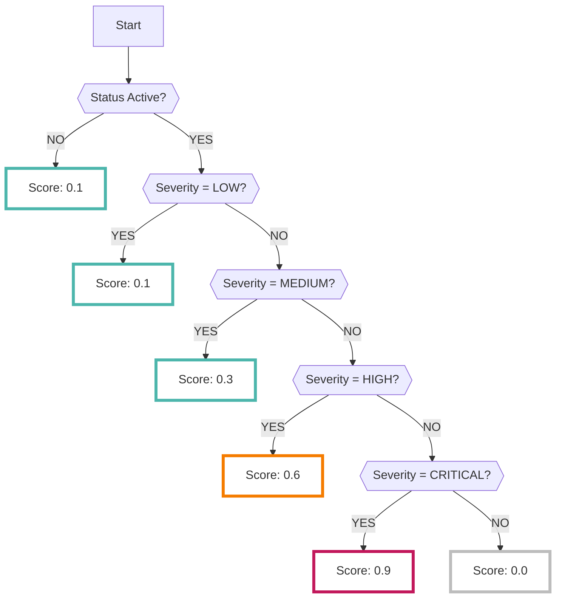

# Security Command Center

When the SCC data source is enabled, the results analyzed by the [Google Cloud Security Command Center (SCC) service :octicons-link-external-24:](https://cloud.google.com/security-command-center/docs/concepts-security-command-center-overview){ target="_blank" } are collected.

???+ help "What is Security Command Center?"
    - SCC is a security service for threat detection provided by Google.
    - To see what items are detected by SCC, please refer to the [official documentation :octicons-link-external-24:](https://cloud.google.com/security-command-center/docs/concepts-vulnerabilities-findings){ target="_blank" }.


???+ Warning "Security Command Center is a solution for organizations"
    SCC is a security service for [organizations :octicons-link-external-24:](https://cloud.google.com/resource-manager/docs/creating-managing-organization){ target="_blank" }.
    
    - To enable the settings, you must belong to some organization.
    - Service accounts must also be registered with the organization's IAM.
        - Set the following roles for the service account:
            - Security Center Findings Viewer (`roles/securitycenter.findingsViewer`)
        - Alternatively, set a custom role that includes the following permissions (SCC reference permissions):
        ```yaml
        - securitycenter.findings.group
        - securitycenter.findings.list
        - securitycenter.findings.listFindingPropertyNames
        - securitycenter.sources.get
        - securitycenter.sources.list
        ```
        - For more information, see [Granting service account permissions](/google/overview_sa/).


---

## Format

When importing data into RISKEN, the following metadata is added:

| Field Name      | Description                   |
| -------------- | ------------------------------|
| `DataSource`   | google:scc (fixed value)      |
| `ResourceName` | Name of the detected asset    |
| `Description`  | Description                    |
| `Score`        | Refer to [Scoring](/google/scc/#_2) |
| `Tag`          | `google` `gcp` `scc` `{project ID}` `{service name}` |


## Scoring

The result data analyzed by Security Command Center has [Severity information :octicons-link-external-24:](https://cloud.google.com/security-command-center/docs/how-to-use-security-health-analytics#findings-by-severity){ target="_blank" }.

When importing into RISKEN, scoring is performed based on the `Severity` using the following logic.


