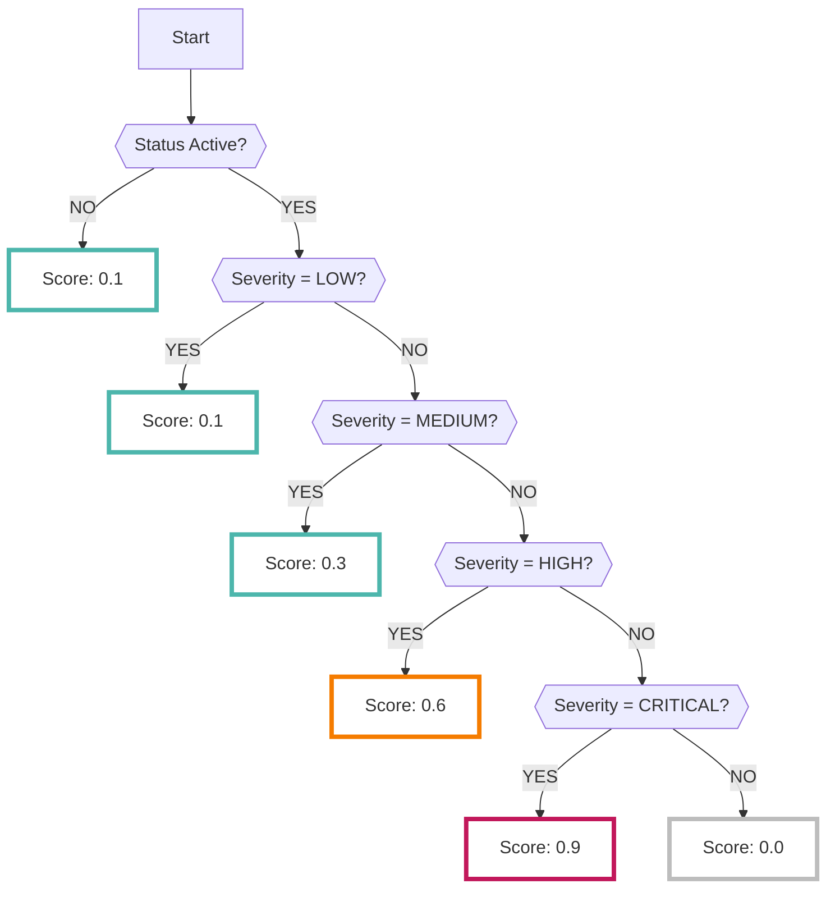

# Security Command Center

SCCデータソースを有効にすると、GCPの[Security Command Centerサービス（SCC） :octicons-link-external-24:](https://cloud.google.com/security-command-center/docs/concepts-security-command-center-overview){ target="_blank" }で分析された結果が収集されます

???+ help "Security Command Centerとは？"
    - SCCは、Googleが提供する驚異検知のためのセキュリティサービスです
    - SCCでどのような項目が検知されるかは[公式ドキュメント :octicons-link-external-24:](https://cloud.google.com/security-command-center/docs/concepts-vulnerabilities-findings){ target="_blank" }を参照してください

???+ Warning "SCCは組織向けのソリューションです"
    SCCは[組織 :octicons-link-external-24:](https://cloud.google.com/resource-manager/docs/creating-managing-organization){ target="_blank" }向けのセキュリティサービスです
    
    そのため設定を有効にするには何らかの組織に属する必要があります

---

## フォーマット

RISKENへデータを取り込む際に、以下のメタデータを付加します

| 項目            | 説明                             |
| -------------- | ------------------------------- |
| `DataSource`   | google:scc (固定)                |
| `ResourceName` | 検出したアセット名                 |
| `Description`  | 説明                             |
| `Score`        | [スコアリング](/google/scc#_2)参照 |
| `Tag`          | `gcp` `scc` `{プロジェクトID}`    |

---

## スコアリング

Security Command Centerで解析された結果データには[Severity情報 :octicons-link-external-24:](https://cloud.google.com/security-command-center/docs/how-to-use-security-health-analytics#findings-by-severity){ target="_blank" } を持っています

RISKENに取り込む際に、以下のロジックによって`Severity`を基準にしたスコアリングを行います

