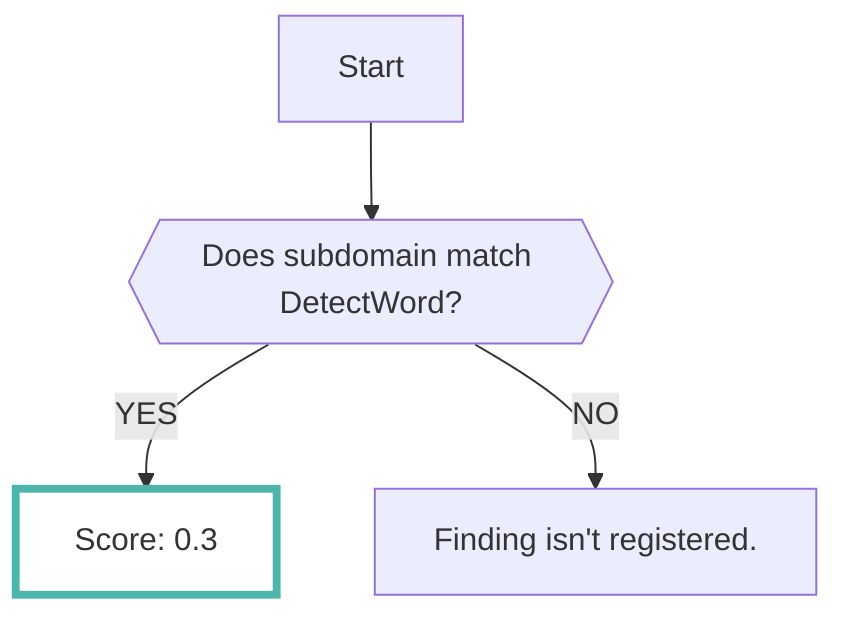
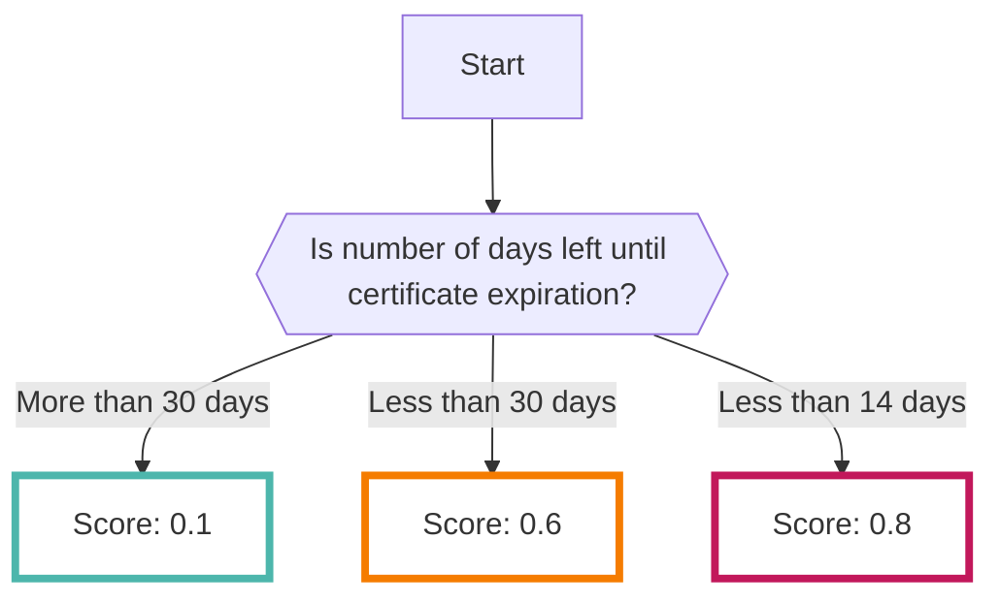
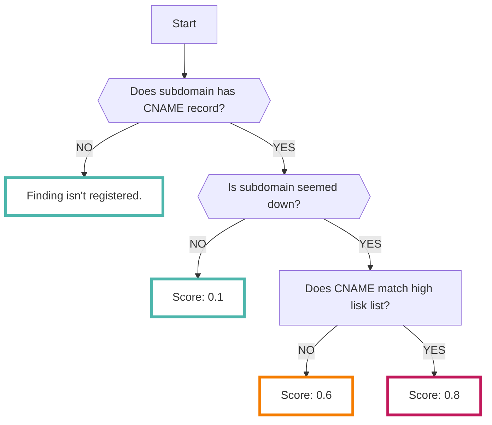

# Domain

By registering domain information that you own, you can detect high-risk subdomains. 

At RISKEN, we analyze domain information by combining multiple OSINT tools.

???+ warning "Coverage of scan target"
    The subdomains targeted for scanning are extracted from those indexed in multiple major search engines. 
    As it is dynamically extracted every time, there is a possibility that the intended domain may not be included.

???+ tip "What is a high-risk domain?"
    RISKEN analyzes domains from the following perspectives:

    - Are there any URLs on the Internet that should not be generally disclosed other than the production environment?
    - Are there any domains that may be subject to [Subdomain Takeover :octicons-link-external-24:](https://developer.mozilla.org/en-US/docs/Web/Security/Subdomain_takeovers){ target="_blank" }?
    - Is the SSL server certificate about to expire?

## Format

When importing data to RISKEN, the following metadata is added:

| Item           | Description                                     |
| -------------- | ----------------------------------------------  |
| `DataSource`   | osint:subdomain (fixed)                          |
| `ResourceName` | Target domain for scanning                      |
| `Description`  | Description                                     |
| `Score`        | See [Scoring](/osint/domain_concept/#_2)         |
| `Tag`          | `osint` `domain` `{Type of risk}` `{Target domain name}` |

## Scoring

As mentioned above, RISKEN determines the risk of a domain based on three factors.

The scoring is as follows for each factor:

???+ warning "Case when the target server is down"
    There are cases where an http(s) request is made during the analysis. 
    If the target server is down at that time, the intended information may not be obtained.

### Environments that should not be generally disclosed are externally disclosed

### The SSL server certificate is about to expire

### Domains with potential for subdomain takeover

The score is calculated based on whether the subdomain has a CNAME record or whether the server/site is down. If the server is down and the risk of subdomain takeover is high, further analysis is conducted.

## Domains with High Risk of Subdomain Takeover

The following list includes domains where it is possible for a third party to easily acquire a CNAME record. If the CNAME record matches any of the domains in the list and accessing the subdomain results in a server/site being down, the risk score will be high.

- us-east-1.elasticbeanstalk.com
- s3.amazonaws.com
- s3-website-{region}.amazonaws.com
- s3-website.{region}.amazonaws.com
- animaapp.io
- bitbucket.io
- furyns.com
- ghost.io
- hatenablog.com
- helpjuice.com
- helpscoutdocs.com
