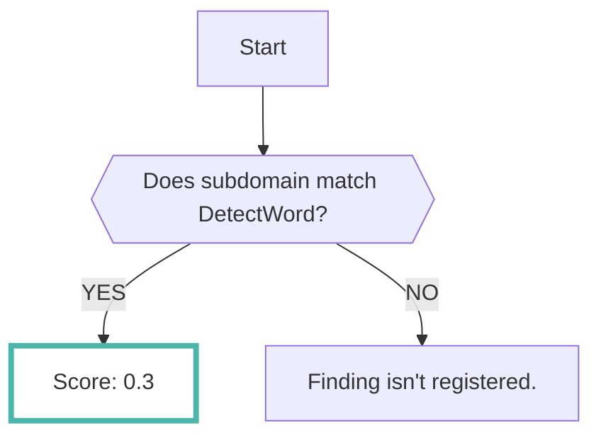

# Domain

あなたが所有しているドメイン情報を登録することで、リスクの高いサブドメインを検出することができます

RISKENではOSINTツールのなかでドメイン情報に関するものを複数組み合わせて分析します

???+ tip "リスクの高いドメインとは？"
    RISKENでは以下の観点でドメインを解析します

    -一般的に公開してはいけないプロダクション環境以外のURLがインターネット上にオープンになっていないか
    -[サブドメインテイクオーバー :octicons-link-external-24:](https://developer.mozilla.org/en-US/docs/Web/Security/Subdomain_takeovers){ target="_blank" } の可能性のあるドメインがないか

## フォーマット

RISKENへデータを取り込む際に、以下のメタデータを付加します

| 項目            | 説明                                            |
| -------------- | ---------------------------------------------- |
| `DataSource`   | osint:subdomain (固定)                          |
| `ResourceName` | スキャン対象のドメイン                             |
| `Description`  | 説明                                            |
| `Score`        | [スコアリング](/osint/domain_concept#_2)参照      |
| `Tag`          | `osint` `domain` `{リスクの種別}`                |

## スコアリング

上述したとおり、RISKENでは2つの観点にてドメインのリスクを判定します

スコアリングは観点ごとに以下の通りとなります

### 一般的に公開してはいけない環境が外部公開されている

### サブドメインテイクオーバーの可能性のあるドメイン

サブドメインがCNameレコードを持っているか、サーバーがダウンしているかによってスコアを算出します

サーバーがダウンしていて、かつ後述のサブドメインていくオーバーのリスクが高いドメインの場合にはさらにスコアが高くなります

## サブドメインていくオーバーのリスクが高いドメイン

下記のリストは第三者がCNameを容易に取得できることが考えられるリストです

設定されているCNameがリストに該当する場合、サブドメインにアクセスした結果サーバーがダウンしている場合にはスコアが高くなります

- herokuapp.com
- herokussl.com
- azurewebsites.net
- cloudapp.net
- azure-api.net
- trafficmanager.net
- azureedge.net
- cloudapp.azure.com
- s3.amazonaws.com
- awsptr.com
- elasticbeanstalk.com
- uservoice.com
- unbouncepages.com
- ghs.google.com
- ghs.googlehosted.com
- ghs-ssl.googlehosted.com
- github.io
- www.gitbooks.io
- sendgrid.net
- feedpress.me
- fastly.net
- webflow.io
- proxy.webflow.com
- helpscoutdocs.com
- readmessl.com
- desk.com
- zendesk.com
- mktoweb.com
- wordpress.com
- wpengine.com
- cloudflare.net
- netlify.com
- bydiscourse.com
- netdna-cdn.com
- pageserve.co
- pantheonsite.io
- arlo.co
- apigee.net
- pmail5.com
- cm-hosting.com
- ext-cust.squarespace.com
- ext.squarespace.com
- www.squarespace6.com
- locationinsight.com
- helpsite.io
- saas.moonami.com
- custom.bnc.lt
- qualtrics.com
- dotcmscloud.net
- dotcmscloud.com
- knowledgeowl.com
- atlashost.eu
- headwayapp.co
- domain.pixieset.com
- cname.bitly.com
- awmdm.com
- meteor.com
- postaffiliatepro.com
- na.iso.postaffiliatepro.com
- copiny.com
- kxcdn.com
- phs.getpostman.com
- appdirect.com
- streamshark.io