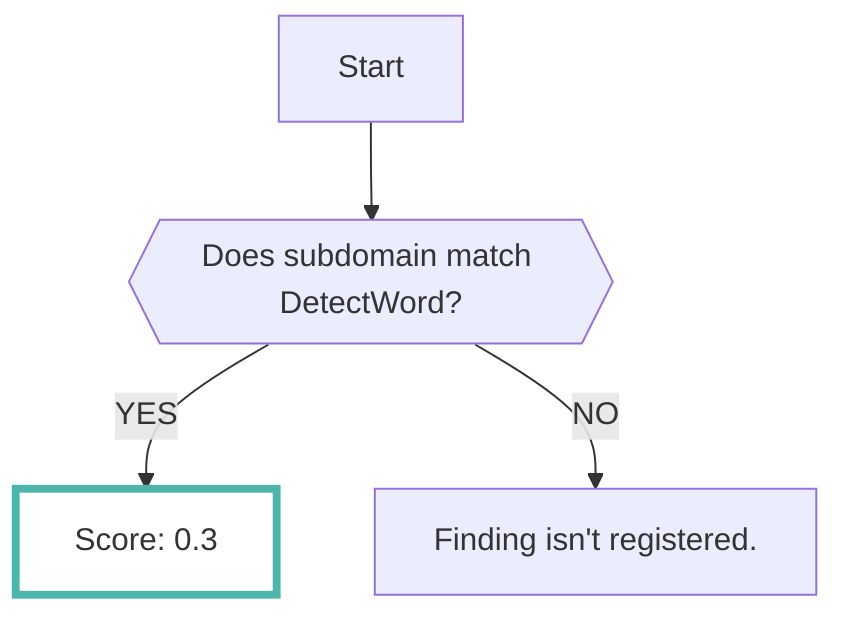
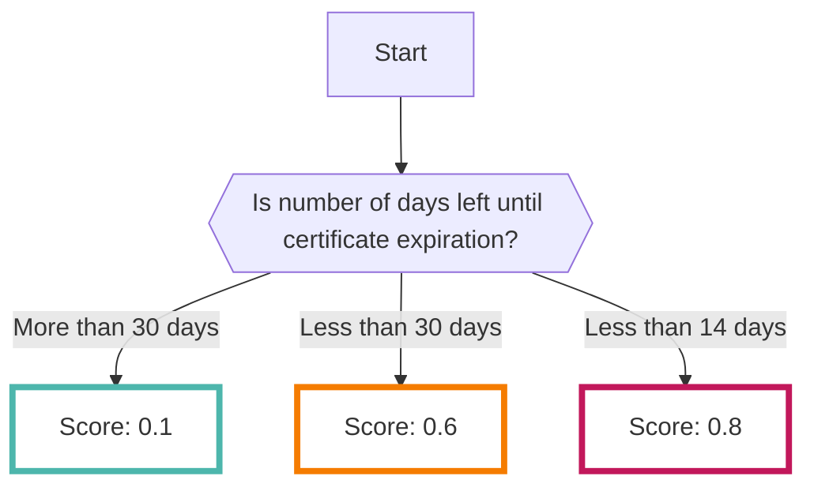
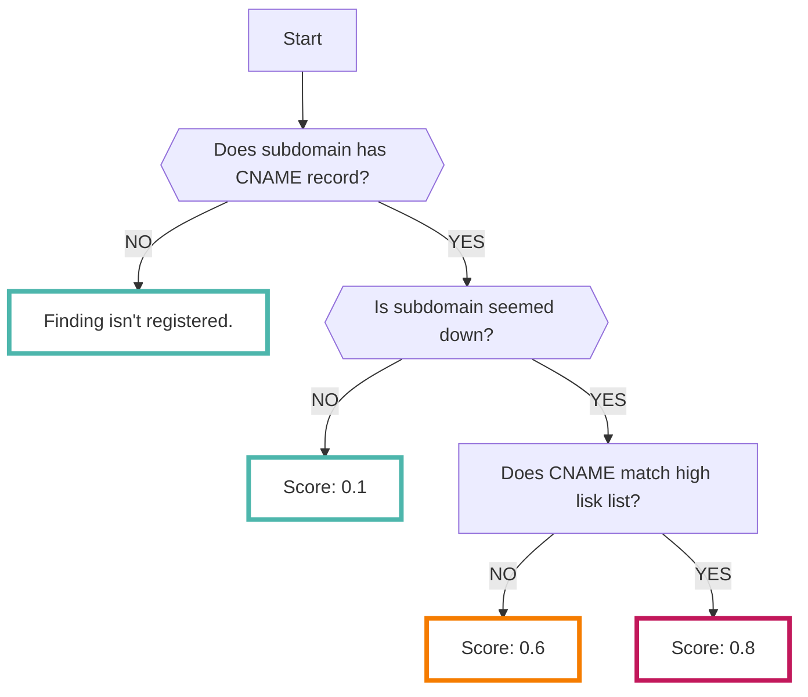

# Domain

あなたが所有しているドメイン情報を登録することで、リスクの高いサブドメインを検出することができます

RISKENではOSINTツールのなかでドメイン情報に関するものを複数組み合わせて分析します

???+ tip "リスクの高いドメインとは？"
    RISKENでは以下の観点でドメインを解析します

    - 一般的に公開してはいけないプロダクション環境以外のURLがインターネット上にオープンになっていないか
    - [サブドメインテイクオーバー :octicons-link-external-24:](https://developer.mozilla.org/en-US/docs/Web/Security/Subdomain_takeovers){ target="_blank" } の可能性のあるドメインがないか
    - SSLサーバー証明書が有効期限切れ間近になっていないか

## フォーマット

RISKENへデータを取り込む際に、以下のメタデータを付加します

| 項目            | 説明                                            |
| -------------- | ---------------------------------------------- |
| `DataSource`   | osint:subdomain (固定)                          |
| `ResourceName` | スキャン対象のドメイン                             |
| `Description`  | 説明                                            |
| `Score`        | [スコアリング](/osint/domain_concept/#_2)参照      |
| `Tag`          | `osint` `domain` `{リスクの種別}` `{スキャン対象のドメイン名}`  |

## スコアリング

上述したとおり、RISKENでは3つの観点にてドメインのリスクを判定します

スコアリングは観点ごとに以下の通りとなります

### 一般的に公開してはいけない環境が外部公開されている

### SSLサーバー証明書が有効期限切れ間近になっている

### サブドメインテイクオーバーの可能性のあるドメイン

サブドメインがCNAMEレコードを持っているか、サーバー／サイトがダウンしているかによってスコアを算出します

サーバーがダウンしていて、かつ後述のサブドメインテイクオーバーのリスクが高いドメインの場合にはさらにスコアが高くなります

## サブドメインテイクオーバーのリスクが高いドメイン

下記のリストは第三者がCNAMEを容易に取得できることが考えられるリストです

設定されているCNAMEがリストに該当する場合、サブドメインにアクセスした結果サーバー／サイトがダウンしている場合にはスコアが高くなります

- us-east-1.elasticbeanstalk.com
- s3.amazonaws.com
- s3-website-{region}.amazonaws.com
- s3-website.{region}.amazonaws.com
- animaapp.io
- bitbucket.io
- furyns.com
- ghost.io
- hatenablog.com
- helpjuice.com
- helpscoutdocs.com
